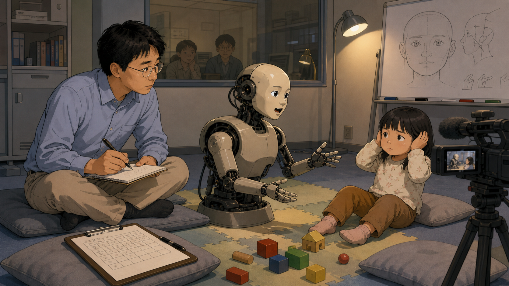
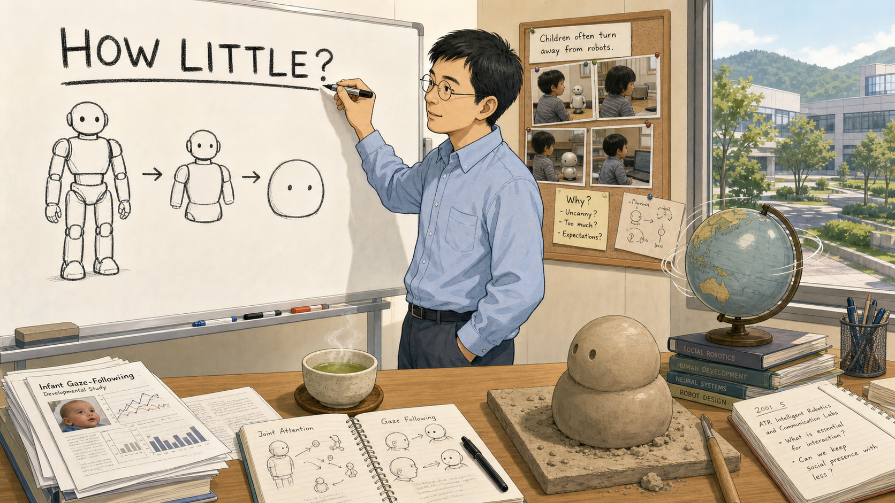
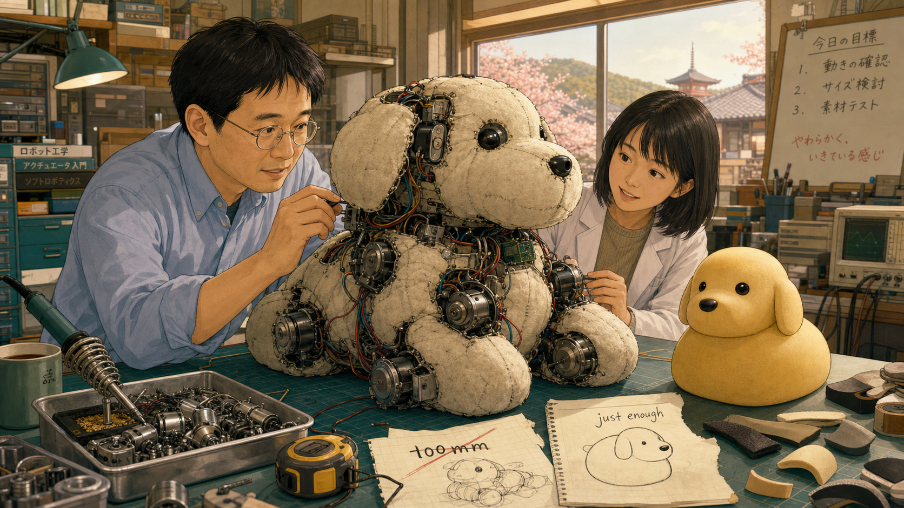
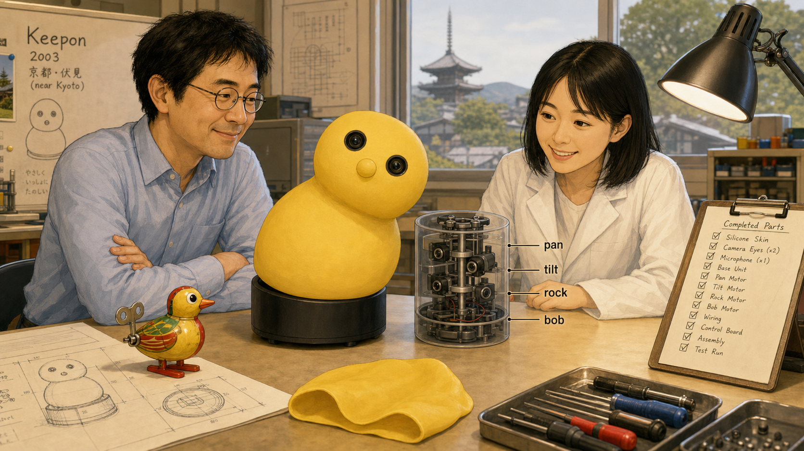
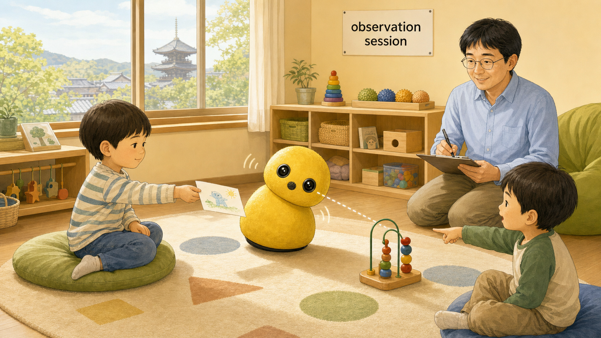

# Small Robot, Big Attention

Cover Image Prompt

(This is the Cover Image. Do not include this label in the image.)
Please generate a wide-landscape 16:9 cover image in a contemporary early-2000s
Japanese clean, warm, toy-like industrial-design illustration style with soft
rounded forms, evoking a research-lab-meets-playroom setting. Show Keepon, a
small yellow snowman-shaped robot about the size of a grapefruit, with two
round black camera-lens eyes, a small round microphone nose, and a soft
silicone-rubber body with no arms, no mouth, and no eyebrows, resting on a low
wooden table in a bright research lab in Keihanna Science City near Kyoto,
Japan, in 2003. Beside the table kneels Hideki Kozima, a Japanese man in his
late thirties with short black hair, round wire-frame glasses, and a pale blue
collared shirt with sleeves rolled up, watching warmly as a small child leans
in and points at the robot. Render the title "SMALL ROBOT, BIG ATTENTION" in
large, clean modern sans-serif lettering across the top of the image. Include
soft foam floor mats, a shelf of wooden building blocks, a corkboard pinned
with simple gaze-direction sketches, warm sunlight through tall lab windows,
an open notebook of pan-and-tilt diagrams, and a taller, more complex
tabletop humanoid robot resting unused on a shelf in the background. Color
palette: warm yellow, soft cream, gentle sky blue, and light wood tones.
Emotional tone: quiet wonder and tender curiosity. Generate the image
immediately without asking clarifying questions.

Narrative Prompt

This is a historically grounded educational case study for students in grades
9-12, set in Japan in the early-to-mid 2000s. It follows researcher Hideki
Kozima, then at Japan's Communications Research Laboratory / National
Institute of Information and Communications Technology (NICT) in Keihanna
Science City near Kyoto, as he leads development of Keepon, a minimalist
social robot first built around 2003. The story traces his research question
(how little movement and face a robot actually needs to share attention with
a child), the deliberate stripping-down of an earlier, more complex humanoid
robot called Infanoid into Keepon's four-degree-of-freedom yellow body, field
studies with children including children on the autism spectrum, and the 2007
"My Keepon" viral video that introduced the robot to a worldwide audience.
Central theme: finding the minimum movement needed for shared attention. No
reliable public birth year for Kozima could be verified, so the story refers
to him only as a contemporary Japanese researcher and states no age or birth
year. Character-consistency note: Kozima is a Japanese man in his late
thirties to mid-forties across the story's span, with short black hair, round
wire-frame glasses, and a pale blue or white collared shirt; his real-life
collaborator Cocoro Nakagawa is depicted as a Japanese woman engineer in her
late twenties to early thirties with shoulder-length black hair and a lab
coat over casual clothes; all children shown are composite, non-identifying
figures treated with warmth and dignity. Dramatized detail: specific
dialogue, exact camera angles, and interior thoughts are invented for
narrative pacing, but the research timeline, design decisions, and viral
video details are drawn from Kozima's published papers and contemporaneous
reporting.

### Prologue – How Little Is Enough?

In a research lab outside Kyoto in the early 2000s, a scientist kept asking
one deceptively simple question: how much face does a robot actually need? A
walking, talking, expressive humanoid was easy to be impressed by, but it was
surprisingly easy to overwhelm a young child with. Hideki Kozima set out to
find the opposite extreme — the smallest number of moving parts that could
still make a child feel truly seen. What he built instead of a face would
travel farther than anyone expected.

## Panel 1: The Robot That Tried Too Hard

Image Prompt

(This is Panel 01. Do not include the panel number in the image.)
I am about to ask you to generate a series of images for a graphic novel.
Please make the images have a consistent style and consistent characters.
Do not ask any clarifying questions. Just generate the image immediately
when asked.

Please generate a wide-landscape 16:9 image in a contemporary early-2000s
Japanese clean, warm, toy-like industrial-design illustration style depicting
panel 1 of 6. Show Hideki Kozima, a Japanese man in his late thirties with
short black hair, round wire-frame glasses, and a pale blue collared shirt,
sitting cross-legged on a foam mat in a NICT research lab near Kyoto, Japan,
in 2001, taking notes as he watches a study session. In front of him,
Infanoid, an upper-torso humanoid robot with a molded plastic face, blinking
eyes, a moving mouth, and two articulated hands, turns toward a small child
seated on the mat. The child leans back and covers her ears, looking
uncertain rather than delighted. Include a video camera on a tripod recording
the session, a clipboard with a half-filled observation chart, scattered toy
blocks, a one-way observation window in the background, a whiteboard sketch
of a human face, and soft gray floor cushions. Color palette: muted lab
gray, warm skin tones, soft yellow lamp light, and cool blue shadows.
Emotional tone: gentle concern and quiet realization. Generate the image
immediately without asking clarifying questions.

Kozima's first robot, Infanoid, had a molded face, blinking eyes, and hands
that could point and reach. It was built to study joint attention, the
moment when two minds lock onto the same object and share a thought without
words. In session after session, though, some children — especially children
on the autism spectrum — froze up or looked away instead of leaning in.
Infanoid was not too weak to communicate; it was too loud.

## Panel 2: Sketching the Smallest Robot

Image Prompt

(This is Panel 02. Do not include the panel number in the image.)
Please generate a wide-landscape 16:9 image in the same contemporary
early-2000s Japanese clean, warm, toy-like industrial-design illustration
style depicting panel 2 of 6. Make Kozima's appearance consistent with the
prior panel. Show Kozima standing at a whiteboard in his NICT office near
Kyoto in 2001, marking a big question in Japanese-influenced lettering style
that reads simply "HOW LITTLE?" above a row of shrinking robot sketches: a
full humanoid figure, then a simplified torso, then a plain round shape with
only two dots for eyes. Include a small stack of research papers on infant
gaze-following, a cup of green tea steaming on the desk, a corkboard with
photos of children's faces turned away from a robot, a spinning desk globe,
a window overlooking a quiet science-park courtyard, and a rough clay model
of a rounded body shape sitting on the desk. Color palette: whiteboard white,
soft charcoal ink, warm wood desk tones, and pale green tea steam. Emotional
tone: focused curiosity and the spark of a new idea. Generate the image
immediately without asking clarifying questions.

So Kozima flipped the question around. Instead of asking how much a robot
could do, he asked how little it needed to do to still feel present and
attentive. Joint attention, he reasoned, might not require a face at all —
just something that could reliably turn to look at what a child was looking
at. If bobbing and rocking alone could carry warmth, an intimidating face
might be optional equipment rather than a requirement.

## Panel 3: A Bulky Prototype and a Fresh Start

Image Prompt

(This is Panel 03. Do not include the panel number in the image.)
Please generate a wide-landscape 16:9 image in the same contemporary
early-2000s Japanese clean, warm, toy-like industrial-design illustration
style depicting panel 3 of 6. Keep Kozima's appearance consistent with prior
panels. Introduce Cocoro Nakagawa, a Japanese woman engineer in her late
twenties with shoulder-length black hair and a white lab coat over a casual
sweater, working beside Kozima at a cluttered workbench in a NICT workshop
near Kyoto in spring 2002. On the bench sits an oversized, lumpy stuffed-dog
robot prototype bristling with eight visible small motors and loose wiring,
clearly too bulky and mechanical-looking. Beside it sits a much smaller,
smooth, rounded yellow foam model with no limbs at all. Include a motor parts
tray, a soldering iron resting in its stand, a tape measure, a torn sketch
labeled with a crossed-out "100mm," a second sketch labeled "just enough,"
scattered rubber test skins, and warm afternoon light through a workshop
window. Color palette: workshop teal, warm yellow foam, brushed metal, and
soft amber light. Emotional tone: playful trial-and-error determination.
Generate the image immediately without asking clarifying questions.

Working with engineer Cocoro Nakagawa in the spring of 2002, Kozima tried
stuffing eight motors into a small stuffed-dog shape, and the result was
bulky, mechanical, and not the least bit charming. The two scientists started
over, stripping the design down to only what mattered: a shape that could
turn to look, and a body that could move with feeling. That leaner idea
became Keepon — a name and a form built around doing less, better.

## Panel 4: Four Motions, No Face

Image Prompt

(This is Panel 04. Do not include the panel number in the image.)
Please generate a wide-landscape 16:9 image in the same contemporary
early-2000s Japanese clean, warm, toy-like industrial-design illustration
style depicting panel 4 of 6. Keep Kozima and Nakagawa consistent with prior
panels. Show a technical cutaway illustration style scene set in the NICT
workshop near Kyoto in 2003: the finished Keepon robot sits center-frame, a
small yellow snowman-shaped body of soft silicone rubber with two round
black camera-lens eyes, a round microphone-nose bump, and no arms, mouth, or
eyebrows at all. A ghosted, labeled cutaway view beside it shows the black
cylindrical base housing four small motors, labeled with simple icons for
"pan," "tilt," "rock," and "bob." Kozima and Nakagawa stand on either side,
smiling as they watch Keepon tilt its whole body toward a wind-up toy being
held just off to the side. Include a technical drawing pinned nearby, a
spare silicone skin laid flat, a small screwdriver set, a completed parts
checklist, and warm task lighting over the bench. Color palette: warm yellow,
matte black, brushed silver, and soft workshop cream. Emotional tone: quiet
pride in a finished, honest design. Generate the image immediately without
asking clarifying questions.

By 2003, Keepon was finished, and it did remarkably little on paper: pan,
tilt, rock, and bob — four simple motions and nothing else. Two color
cameras behind its eyes let it track a face or a toy, and a microphone
behind its nose let it register sound. Kozima had deliberately left out
articulated eyebrows and a moving mouth, betting that predictable, gentle
movement would read as calmer and more trustworthy than a busy, human-like
face.

## Panel 5: A Child Leans In

Image Prompt

(This is Panel 05. Do not include the panel number in the image.)
Please generate a wide-landscape 16:9 image in the same contemporary
early-2000s Japanese clean, warm, toy-like industrial-design illustration
style depicting panel 5 of 6. Keep Kozima consistent with prior panels. Set
the scene in a warm, softly lit therapy playroom at NICT near Kyoto in 2004.
A quiet five-year-old boy sits comfortably on a floor cushion, calmly
offering a small paper drawing toward Keepon, whose whole body tilts and
bobs gently toward the boy's outstretched hand as if delighted. Kozima kneels
a respectful distance away with a clipboard, smiling and taking careful
notes rather than intervening. Include a second child in the background
pointing at a toy while Keepon's camera eyes visibly track toward the same
object, a soft rug with simple shapes, a shelf of quiet sensory toys, a
window with gentle daylight, a small sign reading "observation session" in
simple lettering, and a comfortable beanbag chair. Color palette: warm
cream, soft yellow, gentle green, and calm sky blue. Emotional tone: trust,
warmth, and unhurried connection. Generate the image immediately without
asking clarifying questions.

In session after session, children who had startled at Infanoid warmed
right up to Keepon. Some, including children on the autism spectrum,
approached it calmly, gave it drawings, and turned to look at whatever it
turned to look at. Kozima concluded that the trouble had never been a lack
of social interest — complex robots had simply been asking children to
process too much at once. A predictable, low-key presence let real
connection happen instead.

## Panel 6: The World Discovers Keepon

Image Prompt

(This is Panel 06. Do not include the panel number in the image.)
Please generate a wide-landscape 16:9 image in the same contemporary
early-2000s Japanese clean, warm, toy-like industrial-design illustration
style depicting panel 6 of 6. Keep Keepon's design consistent with prior
panels. Show a split composition: on the left, a young researcher films
Keepon on a small desk in a Pittsburgh apartment in March 2007, the robot
bobbing and rocking in rhythm as if dancing, a laptop nearby showing a
simple video-upload progress bar. On the right, a warm glowing world map
covered in small speech-bubble and play-button icons multiplying outward
from a single point, suggesting millions of people watching online. Include
a desk lamp, a webcam on a tripod, a coffee mug, a calendar page marked
March 2007, a growing view-count graphic shown abstractly as a rising bar
without any logos, and a faint reflection of Kozima's lab from earlier
panels visible in a closed laptop screen. Color palette: warm desk-lamp
amber, glowing web-blue, soft yellow robot highlights, and night-time
indigo. Emotional tone: delighted surprise spreading outward. Generate the
image immediately without asking clarifying questions.

In March 2007, a video of Keepon bobbing along to a song spread across the
internet and kept spreading, eventually reaching millions of viewers who
had never heard of joint-attention research. Kozima and his collaborator
Marek Michalowski soon founded a small company to share Keepon more widely.
The world had just learned, one bounce at a time, that a robot's face could
be almost nothing at all and still feel completely alive.

### Epilogue – Doing Less, on Purpose

Keepon never learned to speak, walk, or smile in any conventional sense, and
that was always the point. By refusing to add a single motor or feature
that a shared glance and a rhythmic bob did not require, Kozima proved that
expressiveness is a design choice, not a feature count. Two decades later,
Keepon remains one of the clearest real-world demonstrations that a tiny,
deliberately limited display — the same kind of minimal pixel face students
build in this course — can still feel genuinely present to the person
looking back at it.

| Challenge | How Kozima Responded | Lesson for Today |
|-----------|----------------------|-------------------|
| Complex humanoid robots like Infanoid could overwhelm young children, especially children on the autism spectrum | Stripped the design down to the fewest motions that could still express attention and feeling | More features do not automatically make a face more expressive — fewer, well-timed movements often communicate more clearly |
| A robot needed to show it was paying attention to whatever a child was looking at or pointing to | Gave Keepon just pan and tilt motors so its camera "eyes" could turn toward the same target as the child | Joint attention can be built from a single, well-aimed gaze cue, not a whole animated face |
| Autistic children often found highly expressive or human-like robots intimidating or confusing | Removed the mouth and eyebrows entirely, keeping only calm, rhythmic, predictable movement | Predictable, low-key behavior can be more inviting than realism, especially for neurodivergent users |
| Convincing a wider public that a faceless little robot could feel alive at all | Let Keepon bob and rock to music in a home video that spread worldwide in 2007 | A well-timed rhythmic motion can carry real emotional meaning — the same idea behind idle animation on any small screen |

### Call to Action

The next time you tune an eyebrow angle or add one more animation to your
robot's face, ask Kozima's question first: is this new motion actually
carrying meaning, or is it just noise? Sometimes the bravest design choice
is the one that takes something away.

---

*"As human beings, we tend to look at the same target as others around us,
and in doing so, we can communicate and share the emotion induced by the
target. This is really important for the construction of higher level
empathetic communication in a child's development."*
—Hideki Kozima, interviewed for Tohoku University's Liberal Arts Salon

*"The minimal design of Keepon's appearance and behavior is meant to
intuitively and comfortably convey the robot's expressions of attention and
emotion."*
—Hideki Kozima, Marek P. Michalowski, and Cocoro Nakagawa, "Keepon: A
Playful Robot for Research, Therapy, and Entertainment," *International
Journal of Social Robotics* (2009)

---

## References

1. [Wikipedia: I Turn My Camera On](https://en.wikipedia.org/wiki/I_Turn_My_Camera_On) - Article on the Spoon song used in the viral 2007 "My Keepon" dancing-robot video
2. [Wikipedia: Social robot](https://en.wikipedia.org/wiki/Social_robot) - Background on robots designed for social and nonverbal interaction with people
3. [Wikipedia: National Institute of Information and Communications Technology](https://en.wikipedia.org/wiki/National_Institute_of_Information_and_Communications_Technology) - The Japanese research institute (formerly Communications Research Laboratory) where Kozima developed Keepon
4. [Springer: Keepon - A Playful Robot for Research, Therapy, and Entertainment](https://link.springer.com/article/10.1007/s12369-008-0009-8) - Kozima, Michalowski, and Nakagawa's peer-reviewed paper describing Keepon's design and field studies
5. [Tohoku University: Liberal Arts Salon featuring Hideki Kozima](https://www.tohoku.ac.jp/en/news/university_news/liberal_arts_salon_hideki_k.html) - University profile and interview covering Kozima's career and research philosophy
