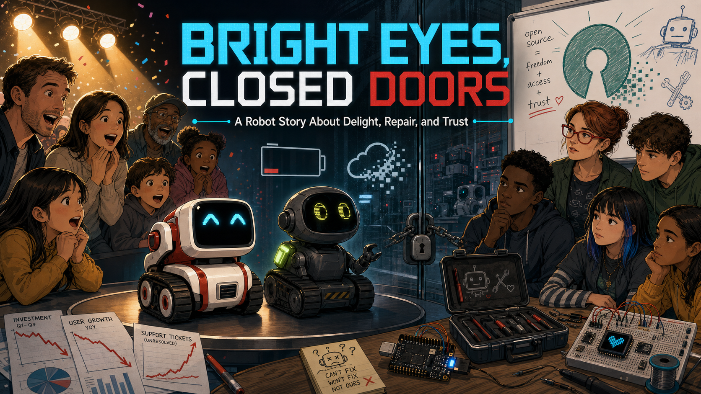

# Robot Faces Stories

These illustrated case studies look behind expressive robot faces to ask a
larger question: what makes educational technology last?

- **[Bright Eyes, Closed Doors](anki-cozmo-vector/index.md)**

    

    Anki's Cozmo and Vector made small robots feel astonishingly alive. Their
    expressive eyes, animation, and approachable coding tools inspired
    students and makers—but sealed hardware, company-controlled software, and
    an unsustainable business model made them difficult for schools to depend
    on for the long term.

