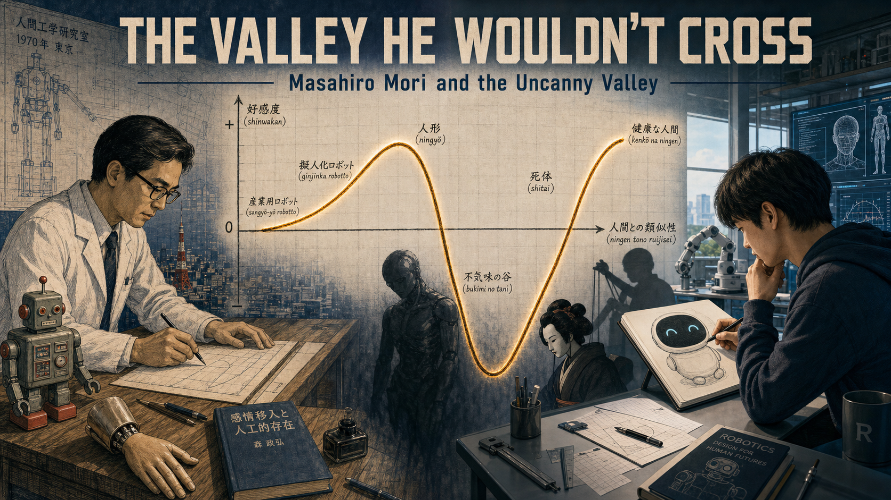
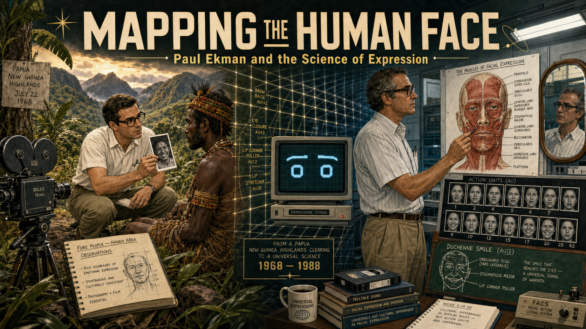
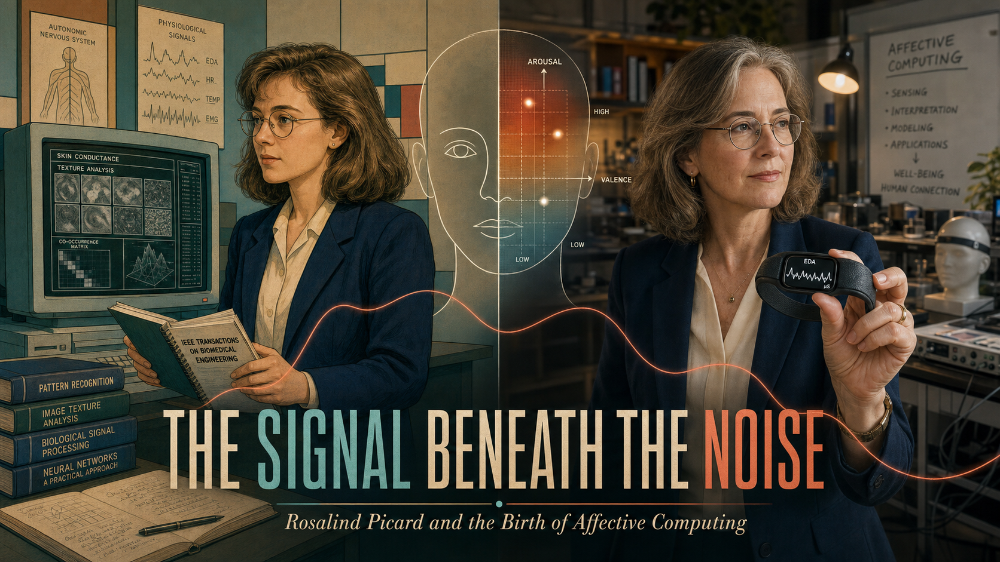
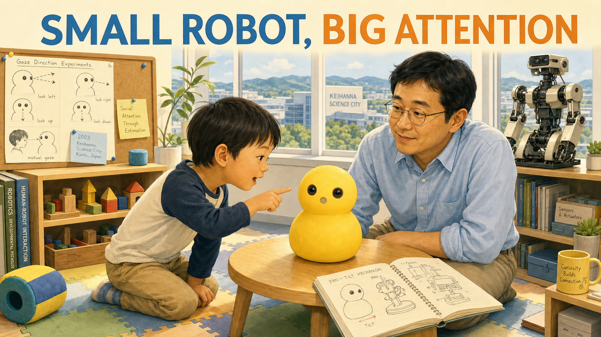
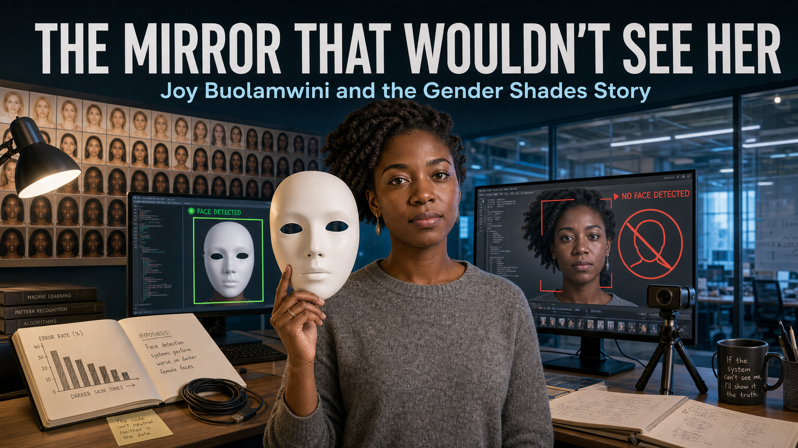

# Robot Faces Stories

These illustrated case studies look behind expressive robot faces to ask a
larger question: what makes educational technology last?

- **[Bright Eyes, Closed Doors](anki-cozmo-vector/index.md)**

    

    Anki's Cozmo and Vector made small robots feel astonishingly alive. Their
    expressive eyes, animation, and approachable coding tools inspired
    students and makers—but sealed hardware, company-controlled software, and
    an unsustainable business model made them difficult for schools to depend
    on for the long term.

- **[The Valley He Wouldn't Cross](masahiro-mori/index.md)**

    <!--  -->

    When a realistic prosthetic hand felt eerie instead of comforting,
    Japanese roboticist Masahiro Mori graphed the feeling instead of ignoring
    it—and his forgotten 1970 sketch of the "uncanny valley" became one of
    robotics' most enduring design lessons.

- **[Mapping the Human Face](paul-ekman/index.md)**

    

    Paul Ekman spent a lifetime turning the fleeting human face into precise,
    measurable data—first proving that some expressions cross every culture,
    then building the Facial Action Coding System that robot-face designers
    still use today.

- **[No Map, No Plan](rodney-brooks/index.md)**

    <!--  -->

    In the 1980s, Rodney Brooks bet that robots didn't need maps or master
    plans to be smart—just fast, layered reactions to the real world. Follow
    his insect-like robots, the humanoid Cog, and the spark that became
    social robotics and the Roomba.

- **[The Signal Beneath the Noise](rosalind-picard/index.md)**

    <!--  -->

    Rosalind Picard risked her reputation as a respected MIT Media Lab
    computer-vision researcher to argue that emotion isn't noise but
    essential data, founding affective computing and building the wearable
    sensors that grew from that bold idea.

- **[Kismet's Gaze](cynthia-breazeal/index.md)**

    <!--  -->

    Follow MIT roboticist Cynthia Breazeal as she leaves full-body robots
    behind to build Kismet—an expressive robot head that learns to connect
    with people through gaze, timing, and emotion, founding the field of
    social robotics along the way.

- **[Small Robot, Big Attention](hideki-kozima/index.md)**

    <!--  -->

    Researcher Hideki Kozima asked how little a robot needs to feel alive—and
    answered with Keepon, a small yellow robot with just two camera eyes, a
    microphone nose, and four gentle motions that let it share a child's gaze
    and rock to music, becoming an unlikely worldwide sensation.

- **[The Mirror That Wouldn't See Her](joy-buolamwini/index.md)**

    

    When facial-detection software failed to recognize her own face, MIT
    researcher Joy Buolamwini didn't shrug it off—she built a fairer
    benchmark, proved the bias with data, and pushed IBM and Microsoft to fix
    it.

