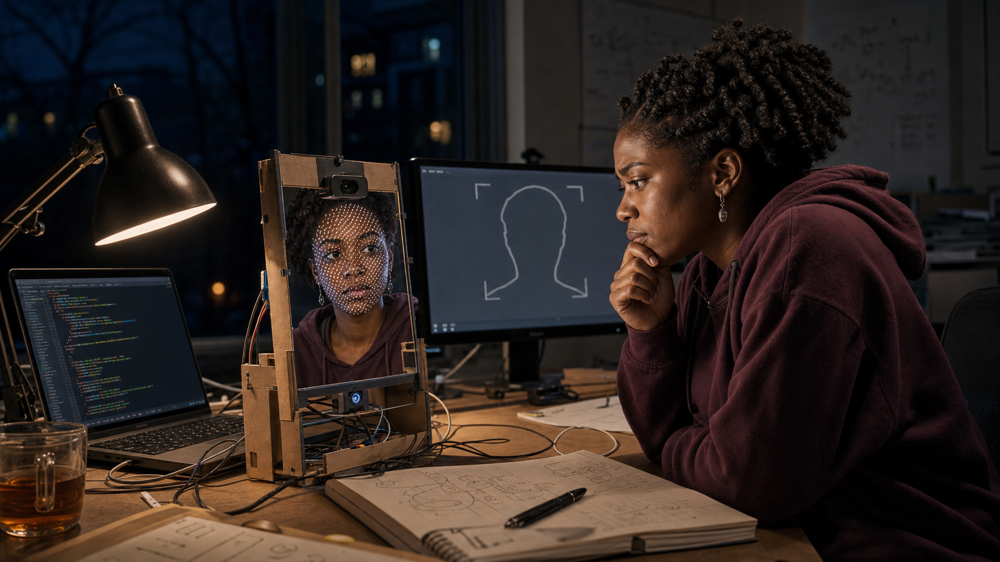
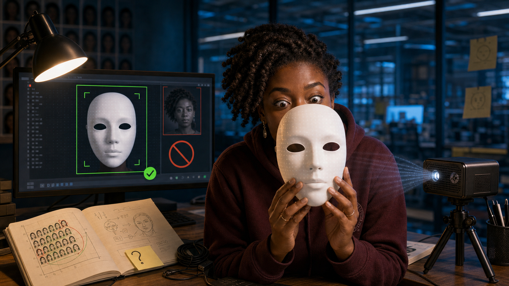
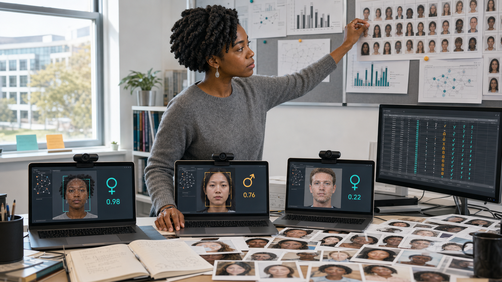
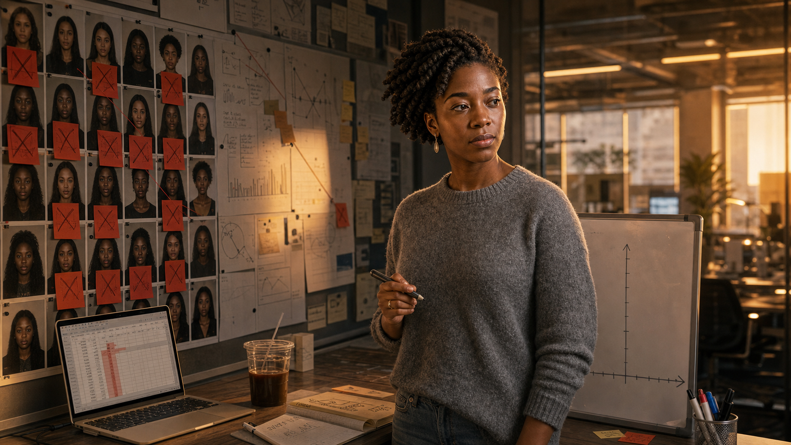
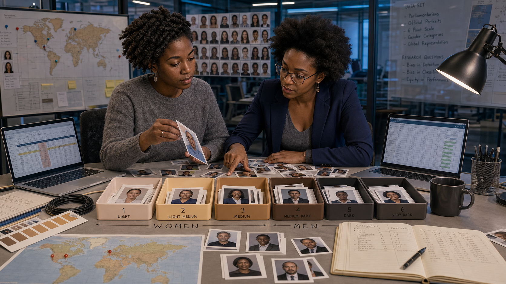
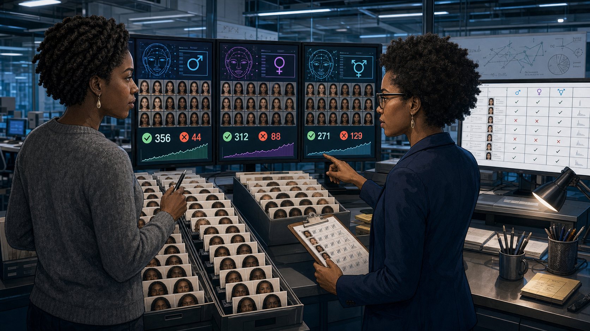
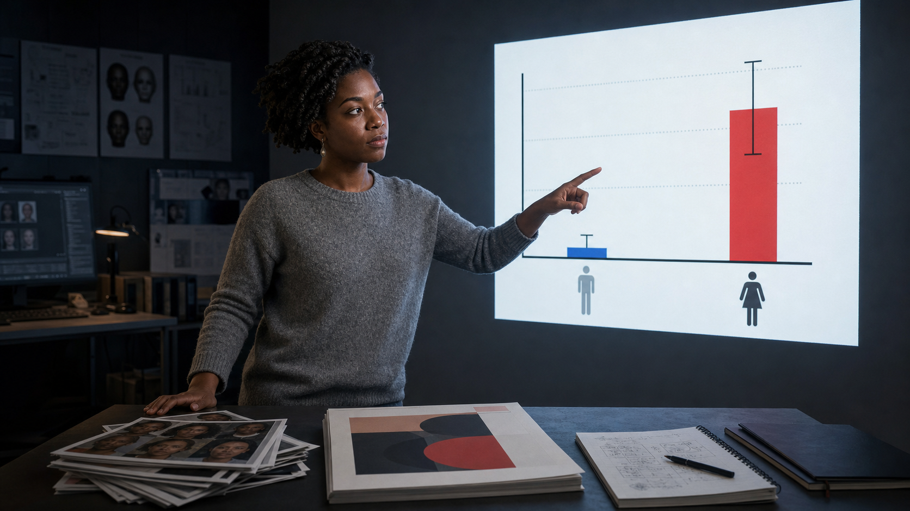

# The Mirror That Wouldn't See Her

Cover Image Prompt

(This is the Cover Image. Do not include this label in the image.)
Please generate a wide-landscape 16:9 cover image in a contemporary
photorealistic-with-period-elements editorial illustration style capturing
MIT Media Lab research culture circa 2018. Center the composition on Joy
Buolamwini, a Black woman graduate researcher in her late twenties with dark
brown skin and natural black hair worn in twists, wearing a simple heather-gray
sweater, standing in a modern research lab and holding a plain white
featureless theatrical mask beside her own bare face. On one monitor behind
her, a green bounding box locks confidently onto the white mask; on another,
a red "no face detected" icon hovers over a live feed of her unmasked face.
Include a wall of small reference photos arranged in a gradient from light to
dark skin tone (the Fitzpatrick scale), a webcam on a small tripod, an open
lab notebook with a hand-drawn bar chart, a coiled USB cable, warm desk-lamp
light mixing with cool blue monitor glow, and the Media Lab's glass-walled
open architecture visible in the background. Render the title "THE MIRROR
THAT WOULDN'T SEE HER" in clean modern geometric sans-serif lettering across
the top, with the subtitle "Joy Buolamwini and the Gender Shades Story"
beneath it. Color palette: cool cyan monitor glow, warm honest skin tones
across the reference wall, charcoal and white lab surfaces, one alert-red
accent. Emotional tone: quiet determination turning a personal glitch into
a rigorous investigation. Generate the image immediately without asking
clarifying questions.

Narrative Prompt

This is a historically grounded educational case study for students in
grades 9-12. It follows Joy Buolamwini, a graduate researcher at the MIT
Media Lab in Cambridge, Massachusetts, from 2016 through 2018: her Aspire
Mirror art installation, her discovery that commercial facial-detection
software would not detect her own dark-skinned face but would detect a
plain white mask, her systematic testing of commercial gender-classification
systems, her partnership with AI researcher Timnit Gebru to build the Pilot
Parliaments Benchmark, and the February 2018 public release of the Gender
Shades study and its industry impact. Central themes: turning a personal
anomaly into rigorous evidence, building fair test data instead of trusting
convenient data, and documenting exactly what was tested so a claim of
"high accuracy" can be checked rather than simply believed. Depict Joy
Buolamwini consistently across panels as a Black woman with dark brown skin
and natural black hair worn in twists, based on her well-known public
appearance — never a caricature. Depict Timnit Gebru consistently as a
Black woman with dark brown skin and natural black hair, often shown with
glasses, based on her well-known public appearance. Specific lines of lab
dialogue, whiteboard sketches, and the exact staging of any single scene are
dramatized for narrative flow; the sequence of events — the Aspire Mirror
project, the white-mask discovery, the multi-company benchmark testing, the
Pilot Parliaments Benchmark, and the February 2018 release — is factually
accurate and drawn from MIT News and the published Gender Shades study. All
panels should share the same clean, modern, data-visualization-inflected
research-lab art style so the story reads as one continuous world.

### Prologue – A Face the Camera Could Not Find

In 2016, a graduate student at the MIT Media Lab sat down to test an art
installation she had built, one that used a camera to track a viewer's
face. The software would not find hers. It found her friends' faces, it
found photographs, but it kept failing on her — until she picked up a
plain white mask and held it in front of her skin. This is the story of
what Joy Buolamwini did next: she did not shrug off the glitch, she turned
it into one of the most consequential technology audits of the decade.

## Panel 1: The Aspire Mirror

Image Prompt

(This is Panel 01. Do not include the panel number in the image.)
I am about to ask you to generate a series of images for a graphic novel.
Please make the images have a consistent style and consistent characters.
Do not ask any clarifying questions. Just generate the image immediately
when asked.

Please generate a wide-landscape 16:9 image in a contemporary
photorealistic-with-period-elements research-lab style depicting panel 1 of
9. Show Joy Buolamwini, a Black woman graduate student in her late
twenties with dark brown skin and natural black hair worn in twists,
wearing a maroon MIT hoodie, sitting alone at a desk late at night in a
Media Lab studio in Cambridge, Massachusetts, in 2016. In front of her, a
small custom mirror rig with an embedded webcam and a projector is meant to
overlay digital patterns onto her reflection, but the screen beside it
shows only a gray blank outline where her face should be tracked. Include a
half-built cardboard and acrylic mirror frame, a laptop showing scrolling
code, a tangle of cables, a desk lamp as the only warm light source, a
half-finished cup of tea, and her puzzled, focused expression as she leans
toward the unresponsive screen. Color palette: deep midnight blue, warm
lamp amber, and cool monitor gray. Emotional tone: quiet late-night
puzzlement. Generate the image immediately without asking clarifying
questions.

Joy Buolamwini was building the Aspire Mirror, an art installation meant to
project an inspiring image over a viewer's own reflection using face
tracking. Late one night, testing it alone, she noticed the software
simply refused to find her face. It found the walls, the chair, and
objects on the desk, but her own features seemed invisible to the code.

## Panel 2: The White Mask

Image Prompt

(This is Panel 02. Do not include the panel number in the image.)
Please generate a wide-landscape 16:9 image in the same contemporary
photorealistic-with-period-elements research-lab style depicting panel 2 of
9. Make Joy Buolamwini's appearance consistent with the prior panel: dark
brown skin, natural black hair in twists, maroon MIT hoodie. Show her
sitting at the same desk, now holding a plain white featureless theatrical
mask up in front of her own face. On the monitor beside her, a bright green
bounding box has snapped instantly onto the mask, with a small confidence
readout reading "FACE DETECTED." Include her wide-eyed, startled expression
visible around the edge of the mask, the earlier gray blank tracking screen
still showing in a small picture-in-picture box for contrast, a sticky note
where she has started jotting a question mark, the desk lamp's warm glow,
and the mirror rig's projector now casting a faint pattern onto the mask's
blank surface. Color palette: midnight blue, warm lamp amber, and bright
detection green. Emotional tone: startled realization tipping into
curiosity. Generate the image immediately without asking clarifying
questions.

On a hunch, she held a plain white mask up to her face — and the software
locked on instantly, tracking the mask as confidently as it had ignored her
skin. It was a strange, almost funny discovery, and a troubling one. Joy
did not file it away as a personal inconvenience; she started asking
whether the software had ever been tested on someone who looked like her.

## Panel 3: A Question Becomes a Study

Image Prompt

(This is Panel 03. Do not include the panel number in the image.)
Please generate a wide-landscape 16:9 image in the same contemporary
photorealistic-with-period-elements research-lab style depicting panel 3 of
9. Make Joy Buolamwini's appearance consistent with prior panels: dark
brown skin, natural black hair in twists, now wearing a simple heather-gray
sweater in a daytime lab setting at MIT in 2017. Show her standing before
three separate laptops, each running a different commercial
gender-classification demo with a webcam feed and an "M / F" confidence
output on screen. Include a printed stack of varied face photographs spread
across the desk, a spreadsheet open on a fourth monitor beginning to fill
with pass/fail rows, a bulletin board where she is pinning up printouts
under handwritten labels, natural daylight through a large lab window, and
her focused, methodical expression as she compares results across the
three screens. Color palette: daylight white, soft gray, and accents of
teal and amber on the screens. Emotional tone: methodical curiosity.
Generate the image immediately without asking clarifying questions.

Instead of dismissing the glitch, Joy turned it into a research question:
how accurate were commercial gender-classification systems, really, and
for whom? She began running several companies' publicly available
demos side by side, feeding them a wide range of face photographs and
logging every result. A pattern started to take shape, one result at a
time.

## Panel 4: The Pattern on the Wall

Image Prompt

(This is Panel 04. Do not include the panel number in the image.)
Please generate a wide-landscape 16:9 image in the same contemporary
photorealistic-with-period-elements research-lab style depicting panel 4 of
9. Make Joy Buolamwini's appearance consistent with prior panels: dark
brown skin, natural black hair in twists, heather-gray sweater. Show her
standing back from a large bulletin board covered in printed face photos
sorted into a rough grid, with more red "misclassified" sticky notes
clustered in the darker-skinned, female rows than anywhere else on the
board. Include a marker in her hand, a half-drawn axis on a whiteboard
suggesting a chart she has not finished yet, a laptop showing a lopsided
early spreadsheet total, a cup of coffee gone cold, late-afternoon light
turning orange through the window, and her thoughtful, slightly troubled
expression as she studies the cluster of red notes. Color palette: warm
late-afternoon amber, board-paper white, and warning red accents.
Emotional tone: dawning concern. Generate the image immediately without
asking clarifying questions.

The red sticky notes were not scattered randomly across her board — they
clustered in one corner, on the photos of women with darker skin. Joy
recognized that a handful of demos and a shelf of face photos were not
enough to prove a pattern this important. She needed a bigger, better,
carefully built test.

## Panel 5: Building the Benchmark

Image Prompt

(This is Panel 05. Do not include the panel number in the image.)
Please generate a wide-landscape 16:9 image in the same contemporary
photorealistic-with-period-elements research-lab style depicting panel 5 of
9. Show Joy Buolamwini and Timnit Gebru working together at a shared table
in a Media Lab research space in 2017. Timnit Gebru is a Black woman
researcher with dark brown skin, natural black hair, and glasses, wearing a
navy blazer; Joy Buolamwini keeps her established look of dark brown skin,
natural black hair in twists, and a heather-gray sweater. Between them,
spread across the table, are official government photographs of national
parliament members from several countries, being sorted into labeled trays
marked with a six-step skin-tone scale and gender categories. Include two
open laptops showing a growing structured spreadsheet, a printed copy of
the Fitzpatrick skin-type scale as a color reference strip, a world map
with pins on several countries, careful handwritten labels, and both
women's collaborative, focused expressions as they cross-check an entry
together. Color palette: cool research-blue, warm skin-tone reference
strip, and neutral gray desk tones. Emotional tone: rigorous, purposeful
teamwork. Generate the image immediately without asking clarifying
questions.

Joy partnered with AI researcher Timnit Gebru to solve the data problem at
its root. Together they built the Pilot Parliaments Benchmark, a new set
of face images drawn from the official photos of lawmakers in several
countries chosen specifically to balance skin type and gender. For the
first time, they had a test set that did not quietly favor one kind of
face over another.

## Panel 6: Running the Gender Shades Test

Image Prompt

(This is Panel 06. Do not include the panel number in the image.)
Please generate a wide-landscape 16:9 image in the same contemporary
photorealistic-with-period-elements research-lab style depicting panel 6 of
9. Show Joy Buolamwini and Timnit Gebru, appearances consistent with the
prior panel, standing before a bank of three large monitors in a Media Lab
testing room in early 2018. Each monitor runs a different commercial
gender-classification system processing the same organized set of Pilot
Parliaments Benchmark face photographs, with pass and fail counters
ticking upward in real time beneath each feed. Include a shared results
spreadsheet projected on a fourth screen, printed batches of the balanced
face-photo set organized in trays by skin-type row, a clipboard with a
running tally, cool blue-white lab lighting, and both researchers' alert,
concentrated expressions as they compare the three counters side by side.
Color palette: clinical blue-white, screen cyan, and neutral gray. Emotional
tone: rigorous, high-stakes concentration. Generate the image immediately
without asking clarifying questions.

With a fair benchmark in hand, Joy and Timnit ran a systematic evaluation
across three major commercial gender-classification systems, testing every
face in the same disciplined way. This was not a hunch anymore — it was a
controlled, repeatable experiment with real numbers attached to every
result. The counters on the three screens told a story neither researcher
was surprised to see, but one the world had not yet been shown.

## Panel 7: The Gap on the Chart

Image Prompt

(This is Panel 07. Do not include the panel number in the image.)
Please generate a wide-landscape 16:9 image in the same contemporary
photorealistic-with-period-elements research-lab style depicting panel 7 of
9. Show Joy Buolamwini standing beside a large projected bar chart on a
Media Lab wall screen in 2018, appearance consistent with prior panels. The
chart shows two dramatically different bars: a short bar near the top
labeled with a near-perfect accuracy percentage for lighter-skinned men,
and a tall, stark error bar reaching over a third of the chart labeled with
a high error rate for darker-skinned women. Include her hand pointing at
the gap between the two bars, a printed draft of the research paper on the
table below with the title "Gender Shades" visible on its cover page, a
small stack of the balanced benchmark photos beside it, dim room lighting
that makes the chart glow brighter, and her steady, resolved expression as
she studies the disparity. Color palette: chart white background, alert
red for the tall error bar, cool blue for the short bar, and dim charcoal
room tones. Emotional tone: stark, sobering clarity. Generate the image
immediately without asking clarifying questions.

The chart made the disparity impossible to ignore. Lighter-skinned men were
classified correctly almost every time, with error rates under one
percent, while darker-skinned women were misclassified as often as one
time in three. A number that specific and that large was not noise — it
was evidence of a real design flaw, hiding behind confident-sounding
accuracy claims.

## Panel 8: The Story Goes Public

Image Prompt

(This is Panel 08. Do not include the panel number in the image.)
Please generate a wide-landscape 16:9 image in the same contemporary
photorealistic-with-period-elements research-lab style depicting panel 8 of
9. Show Joy Buolamwini, appearance consistent with prior panels, now
wearing a simple navy blazer, speaking at a small press briefing podium at
MIT in February 2018 with the Gender Shades bar chart projected on a large
screen behind her. Include a row of journalists with notebooks and
recorders, a laptop open to a news website headline about bias in facial
recognition, a second screen showing an abstract corporate statement
document with a pledge to improve accuracy, a table with printed copies of
the study, soft professional stage lighting, and her calm, confident
posture as she gestures toward the chart. Color palette: professional
navy, presentation-screen white, chart red and blue, and warm stage
amber. Emotional tone: public accountability and quiet vindication.
Generate the image immediately without asking clarifying questions.

When the Gender Shades study went public in February 2018, it made
headlines far beyond the research community. Major technology companies
whose systems had been tested, including IBM and Microsoft, publicly
acknowledged the gap and committed to improving their facial-analysis
accuracy. A finding that started with one graduate student and a plain
white mask had reached boardrooms and newsrooms around the world.

## Panel 9: Building the Algorithmic Justice League

Image Prompt

(This is Panel 09. Do not include the panel number in the image.)
Please generate a wide-landscape 16:9 image in the same contemporary
photorealistic-with-period-elements research-lab style depicting panel 9 of
9. Show Joy Buolamwini, appearance consistent with prior panels, standing
in front of a diverse group of students and young researchers in a bright
community workshop space, a few years after the Gender Shades release. A
banner behind her reads "Algorithmic Justice League" above a simple line-art
logo. Include laptops on tables running face-testing demos on a range of
diverse test photos, a wall poster listing "Test who you did not picture"
and "Document what you tested," a young Black girl in the audience raising
her hand with an excited expression, printed copies of the Gender Shades
findings on a resource table, warm daylight through large windows, and
Joy's open, encouraging expression as she gestures toward the audience.
Color palette: bright optimistic teal, warm daylight gold, and clean
white. Emotional tone: hopeful, energizing, forward-looking. Generate the
image immediately without asking clarifying questions.

Joy did not stop at one study. She founded the Algorithmic Justice League
to keep pressure on companies building face-based AI and to teach the next
generation to test their own work honestly. Her white-mask discovery grew
into a career built on one clear principle: a system's accuracy claim
means nothing until someone checks it against the people it was never
tested on.

### Epilogue – Evidence Over Assumption

Joy Buolamwini's story is not really about one broken camera. It is about
what happens when someone refuses to accept "it probably works fine" as an
answer and instead builds the fair test that proves or disproves it. The
Pilot Parliaments Benchmark and the Gender Shades study turned a personal
frustration into a documented, reproducible case that companies could not
wave away — and it changed how the whole field thinks about testing AI.

| Challenge | How Buolamwini Responded | Lesson for Today |
|-----------|---------------------------|------------------|
| Facial-detection software failed to see her own face | Investigated the anomaly systematically instead of dismissing it as a personal glitch | A small, personal error can be evidence of a design flaw that affects many people |
| Existing test data skewed toward lighter-skinned, male faces | Built the Pilot Parliaments Benchmark, a dataset balanced across skin type and gender | A test is only as fair as the data used to run it |
| Companies made confident accuracy claims without showing how they were measured | Ran a transparent, documented, reproducible audit across multiple commercial systems | Publish what you tested, how you tested it, and who you tested it on |
| A single study could not force lasting change on its own | Founded the Algorithmic Justice League to sustain public pressure and teach others to audit AI | Exposing a problem is the first step; sustained advocacy turns evidence into reform |

### Call to Action

Before you call any robot face "done," ask Joy Buolamwini's question:
tested on whom? A face that reads clearly to you and your friends might
fail completely for someone you never pictured while designing it. Test
your expressions on people who do not look like you, write down exactly
who and how you tested, and treat that documentation as part of the
design — not an afterthought.

---

*"Who codes matters, how we code matters, and why we code matters."*
—Joy Buolamwini, TEDxBeaconStreet

*"To fail on one in three, in a commercial system, on something that's
been reduced to a binary classification task, you have to ask, would that
have been permitted if those failure rates were in a different subgroup?"*
—Joy Buolamwini, MIT News, February 2018

*"If you have a face, you have a place in the conversation about AI."*
—Joy Buolamwini, NPR interview, 2023

---

## References

1. [Wikipedia: Joy Buolamwini](https://en.wikipedia.org/wiki/Joy_Buolamwini) - Biography of the computer scientist and founder of the Algorithmic Justice League
2. [Wikipedia: Timnit Gebru](https://en.wikipedia.org/wiki/Timnit_Gebru) - Biography of the AI researcher and co-author of the Gender Shades study
3. [Wikipedia: Algorithmic bias](https://en.wikipedia.org/wiki/Algorithmic_bias) - Background on how automated systems can produce systematically unfair outcomes
4. [MIT News: Study finds gender and skin-type bias in commercial artificial-intelligence systems](https://news.mit.edu/2018/study-finds-gender-skin-type-bias-artificial-intelligence-systems-0212) - The original February 2018 MIT report on the Gender Shades findings
5. [MIT Media Lab: Gender Shades project overview](https://www.media.mit.edu/projects/gender-shades/overview/) - The project page describing the Pilot Parliaments Benchmark and study methodology
