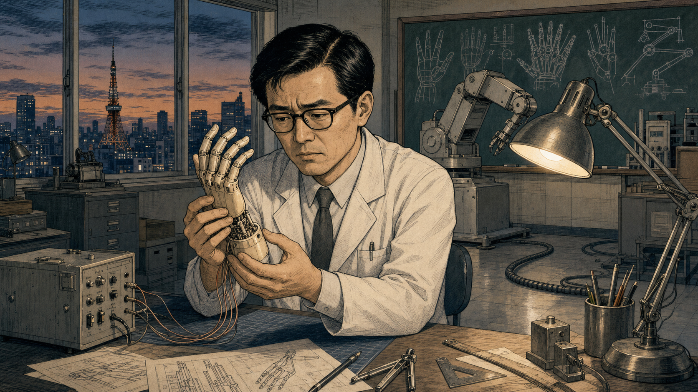
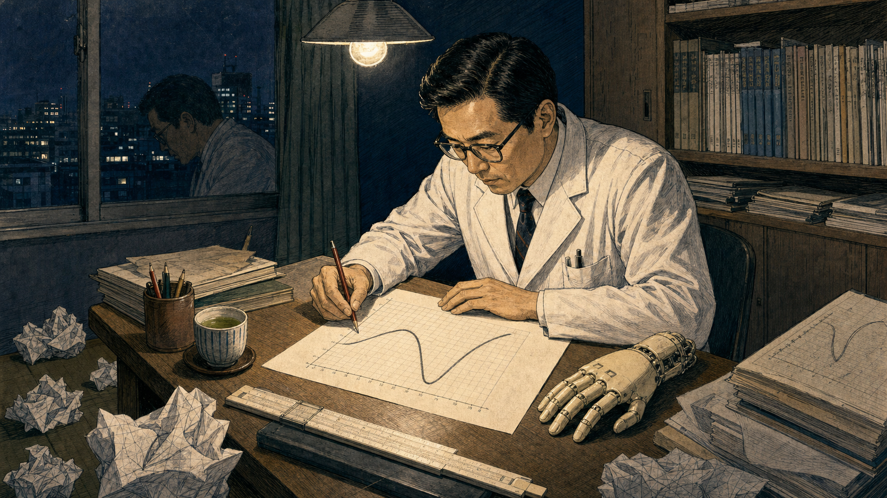
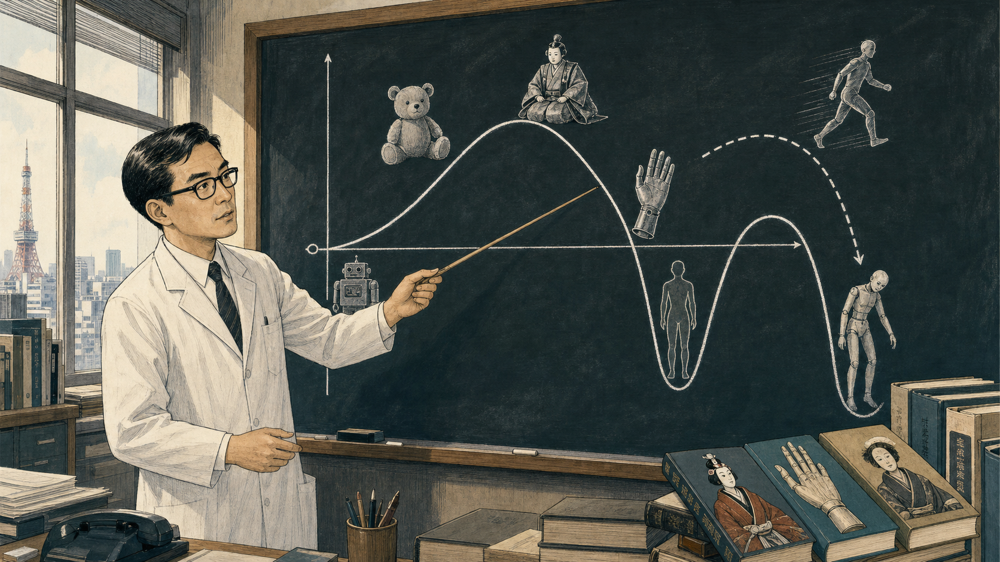
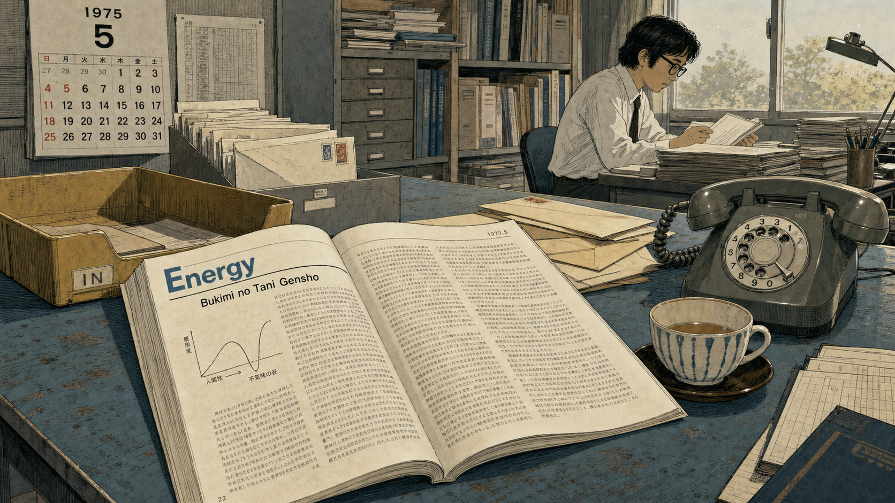
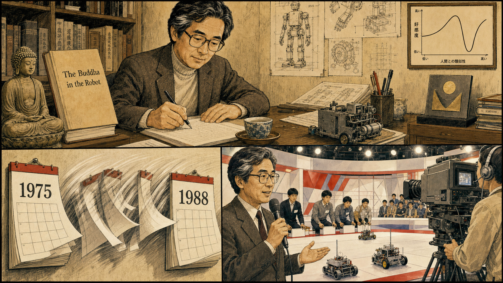
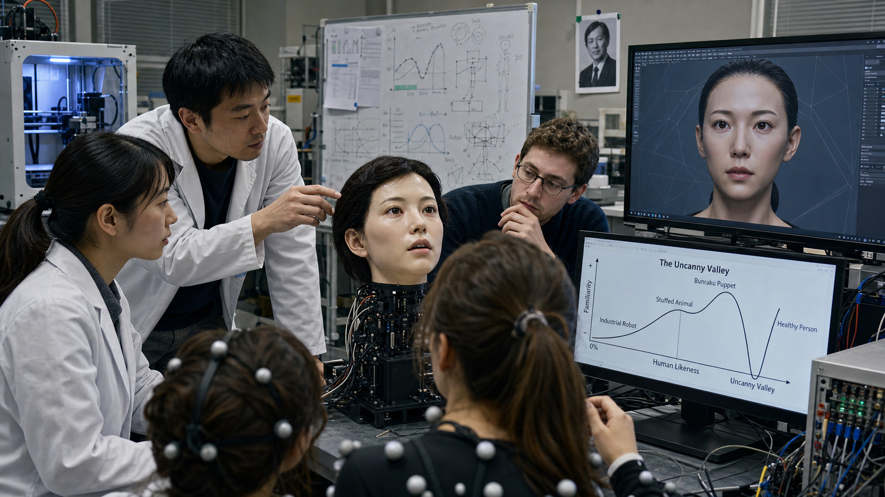
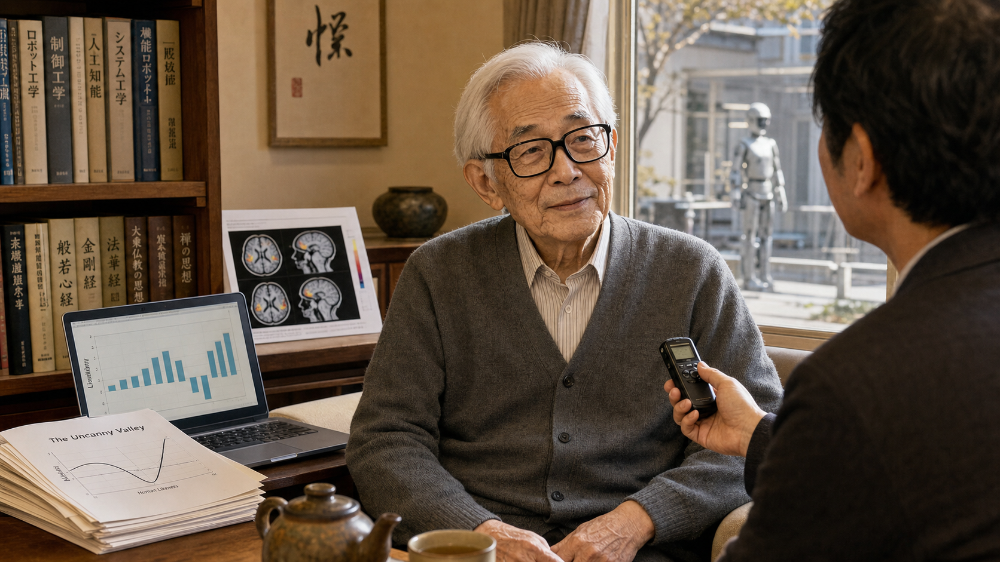
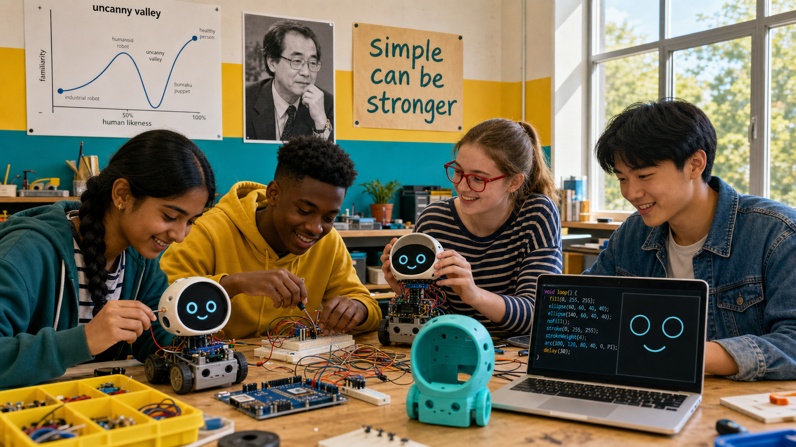

# The Valley He Wouldn't Cross

Cover Image Prompt

(This is the Cover Image. Do not include this label in the image.)
Please generate a wide-landscape 16:9 cover image that visually bridges two
styles across a single composition: the left half rendered in Mid-Century
Japanese technical/industrial illustration (clean cross-hatched engineering
line work, muted blueprint blues, 1970 Tokyo), and the right half rendered in
Contemporary photorealistic-with-period-elements style (present-day robotics
lab). In the center, a large hand-drawn graph dominates the image: a curve
labeled with Japanese and English characters that climbs, plunges into a deep
"valley," then climbs again, exactly as Masahiro Mori originally sketched it.
On the left side of the curve, place a Japanese man in his early forties with
neat black hair, black-rimmed glasses, and a white lab coat over a shirt and
tie, sketching the curve at a wooden drafting table beside a lifelike
prosthetic hand and a simple toy robot. On the right side of the curve, place
a contemporary robotics student sketching a small round-screen robot face with
two simple animated eyes, deliberately choosing NOT to chase realism. Include
a bunraku puppet silhouette, a shadowy humanoid android figure fading into the
valley's lowest point, drafting tools, graph paper, and a single beam of
window light crossing both halves. Render the title "THE VALLEY HE WOULDN'T
CROSS" in bold geometric lettering across the top, with the subtitle
"Masahiro Mori and the Uncanny Valley" beneath it. Color palette: blueprint
navy and warm sepia on the left, cool steel and soft cyan on the right, unified
by a shared amber highlight on the curve itself. Emotional tone: quiet
intellectual discovery bridging into modern relevance. Generate the image
immediately without asking clarifying questions.

Narrative Prompt

This is a historically grounded educational case study for students in grades
9-12 about Masahiro Mori (1927-2025), a Japanese robotics and automation
engineer and professor at Tokyo Institute of Technology, who in 1970 published
an essay in the Japanese magazine Energy proposing "bukimi no tani" (the
uncanny valley) — a curve describing how affinity toward a humanlike figure
rises with realism, then plunges sharply when something looks almost-but-not-
quite human. The essay was largely ignored for decades and was not formally,
Mori-authorized translated into English until 2005 and then more completely in
2012 (by Karl MacDorman and Norri Kageki, published in IEEE Robotics &
Automation Magazine and IEEE Spectrum). It later became a central design
compass in robotics, CGI, and android research, but Mori himself always
treated it as design advice and a hypothesis worth testing, not a proven
scientific law — a distinction he restated directly in interviews late in his
life. Central theme: the courage to question the assumption that "more
realistic is always better," and the humility to call your own famous idea a
hypothesis rather than a fact. ART STYLE TRANSITION: Panels 1 through 5 are
rendered in Mid-Century Japanese technical/industrial illustration style
(clean engineering cross-hatching, blueprint and drafting-table aesthetics,
muted 1970s-1980s Japanese institutional color palettes) to match Mori's own
era at Tokyo Institute of Technology. Panels 6 through 8 shift to Contemporary
photorealistic-with-period-elements style, reflecting the 2000s-2010s-to-
present rediscovery of his work by CGI studios, android researchers, and
today's robot-face designers. Character consistency: Mori is a Japanese man,
early forties in panels 1-5 (neat black hair, black-rimmed glasses, white lab
coat, shirt and tie), appearing only as an archival-style elder portrait
(white hair, same glasses) in panels 6-7 set decades later. Dramatized
details: the story compresses Mori's gradual, years-long observations about
prosthetic hands and robot design into a single illustrated moment of insight
in panels 1-2, for narrative clarity — his actual essay reflects broader
engineering experience, not one isolated incident. Panel 8 lightly connects
this history to this textbook's own Chapter 11 (Expression Design,
Readability & HRI), where the uncanny valley is taught as a reason simple,
abstract robot-face displays can be a design strength rather than a
limitation.

### Prologue – The Hand That Felt Wrong

In 1970, a Japanese engineer sat in a Tokyo robotics laboratory studying a
mechanical hand built to look as close to human as possible. It should have
felt like a triumph of craftsmanship. Instead, something about its stillness,
its almost-right proportions, made him uneasy in a way no clumsy factory robot
ever had. Masahiro Mori decided to draw that feeling as a graph instead of
ignoring it — and the resulting curve would take forty years to matter to
almost anyone else.

## Panel 1: The Hand That Felt Wrong

Image Prompt

(This is Panel 01. Do not include the panel number in the image.)
I am about to ask you to generate a series of images for a graphic novel.
Please make the images have a consistent style and consistent characters.
Do not ask any clarifying questions. Just generate the image immediately
when asked.

Please generate a wide-landscape 16:9 image in Mid-Century Japanese
technical/industrial illustration style (clean cross-hatched engineering
line work, blueprint-adjacent shading) depicting panel 1 of 8. Show Masahiro
Mori, a Japanese man in his early forties with neat black hair, black-rimmed
glasses, and a white lab coat over a shirt and tie, seated at a metal
workbench in a robotics laboratory at Tokyo Institute of Technology, Japan,
in 1970. He holds a lifelike mechanical prosthetic hand connected by thin
wires to a control box, studying its fingers with a furrowed, uneasy
expression rather than pride. Include a simple boxy industrial robot arm in
the background, a chalkboard with rough sketches of hands, drafting tools,
a desk lamp casting a single warm pool of light, a window showing a dim
Tokyo skyline at dusk, and a coiled cable snaking across the floor. Color
palette: muted blueprint blue, warm lamp amber, steel gray, and ivory.
Emotional tone: quiet unease beneath careful scientific curiosity.
Generate the image immediately without asking clarifying questions.

Mori had spent years around robots, from blocky factory arms to delicate
prosthetic hands built to restore a lost limb's function. Most robots never
bothered him, no matter how mechanical they looked. But this hand was
different: realistic enough to almost pass, wrong enough that his skin
prickled the instant it moved. He wrote later that this specific eerie
feeling, not fear of machines in general, was the puzzle worth solving.

## Panel 2: Sketching the Dip

Image Prompt

(This is Panel 02. Do not include the panel number in the image.)
Please generate a wide-landscape 16:9 image in Mid-Century Japanese
technical/industrial illustration style depicting panel 2 of 8. Make Mori
consistent with the prior panel: same Japanese man in his early forties,
black-rimmed glasses, white lab coat. Show him late at night at a small
wooden desk in his university office in Tokyo, 1970, sketching a rough curve
on graph paper by hand, one line rising, dipping sharply, then rising again.
Include crumpled failed sketches scattered on the floor, a cup of cooling
green tea, a slide rule, a small shelf of engineering journals, a single
overhead bulb, the same prosthetic hand resting on the desk beside the
paper, and his own reflection faintly visible in a dark window. Color
palette: deep indigo night tones, warm desk-lamp gold, graphite gray, and
paper cream. Emotional tone: private, focused excitement at the edge of a
discovery. Generate the image immediately without asking clarifying
questions.

Mori stopped trying to explain the feeling in words and reached for graph
paper instead. He drew human likeness along the bottom and comfort, or
"affinity," climbing up the side, and let his pencil trace what his gut had
already told him: comfort rises steadily with realism, then drops off a
cliff right before something looks fully human. He called the sudden drop
*bukimi no tani* — the uncanny valley.

## Panel 3: Naming Every Point on the Curve

Image Prompt

(This is Panel 03. Do not include the panel number in the image.)
Please generate a wide-landscape 16:9 image in Mid-Century Japanese
technical/industrial illustration style depicting panel 3 of 8. Make Mori
consistent with prior panels. Show him standing before a large chalkboard in
his Tokyo Institute of Technology office in 1970, pointing at a carefully
inked version of the uncanny-valley curve now labeled with small drawings
along it: a soft stuffed toy near the first low peak, a boxy industrial
robot near the origin, a bunraku puppet sitting higher on the curve than
expected, a realistic prosthetic hand marked right at the valley's edge, and
a still human corpse marked at the valley's lowest point. A dotted arrow
labeled "movement" stretches from a moving-figure sketch down into an even
deeper trough near a zombie-like shambling figure. Include chalk dust in the
air, a wooden pointer, stacked reference books on puppetry and prosthetics,
and afternoon light through tall office windows. Color palette: chalkboard
black and white, muted teal accents, and warm wood tones. Emotional tone:
methodical clarity, a teacher explaining something he has just understood
himself. Generate the image immediately without asking clarifying
questions.

On the chalkboard, the curve became a map. A stuffed toy and a simple
industrial robot sat safely on the rising slope; a bunraku puppet, despite
modest realism, scored surprisingly high because distance and graceful
movement kept it charming. A prosthetic hand and a human corpse marked the
valley's floor, and Mori noted that movement made everything worse there — a
still corpse was unsettling, but a shambling, moving corpse-like figure was
worse still.

## Panel 4: Buried in an Obscure Magazine

Image Prompt

(This is Panel 04. Do not include the panel number in the image.)
Please generate a wide-landscape 16:9 image in Mid-Century Japanese
technical/industrial illustration style depicting panel 4 of 8. Show a
printed 1970 issue of a modest Japanese engineering magazine called Energy
lying on a cluttered mailroom table at Tokyo Institute of Technology, its
pages open to Mori's short essay "Bukimi no Tani Gensho" with his hand-drawn
curve reprinted small and plain, no illustrations, dense text. Around it,
show a nearly empty in-tray, a few unopened envelopes, a wall calendar
turned to a page in the mid-1970s, a rotary telephone that is not ringing,
and Mori in the background at his desk, still consistent in appearance,
already absorbed in an unrelated stack of robotics papers rather than
waiting for a reaction. Include dust motes in a shaft of window light and a
half-empty teacup. Color palette: faded newsprint gray, dull mustard yellow,
muted blue, and soft cream. Emotional tone: quiet anticlimax, not sadness —
ordinary academic life continuing. Generate the image immediately without
asking clarifying questions.

The essay ran in *Energy*, a small Japanese trade magazine, in 1970. It made
almost no noise. No flood of letters arrived, no international journal
picked it up, and even inside Japan it drew only modest attention for years.
Mori did not treat the silence as failure; he simply moved on to the dozens
of other robotics and automation problems already waiting on his desk.

## Panel 5: Building Other Things While the World Waited

Image Prompt

(This is Panel 05. Do not include the panel number in the image.)
Please generate a wide-landscape 16:9 image in Mid-Century Japanese
technical/industrial illustration style depicting panel 5 of 8, using a
multi-frame montage layout on one wide canvas. Keep Mori consistent, aging
slightly with a few gray streaks by the later frames. In one section, show
him writing at a desk with a manuscript titled (in English lettering for
clarity) "The Buddha in the Robot" beside a small statue of a seated figure
in meditation. In another section, show him founding a national student
robot-building contest, "Robocon," in a television studio around 1988, with
young students' simple wheeled robots competing on a stage under bright
lights and a large studio camera. In a third section, show a wall calendar
flipping rapidly through years from 1975 to 1988. Include engineering
diagrams, teacups, a Robot Association plaque, and a small framed copy of
his uncanny-valley curve hanging quietly, unremarked, on his office wall
throughout. Color palette: warm sepia transitioning toward brighter studio
whites and reds by the final frame. Emotional tone: purposeful, contented,
unhurried. Generate the image immediately without asking clarifying
questions.

Mori's career did not pause to wait for the uncanny valley to become famous.
He wrote on robotics and Buddhist philosophy, arguing that even a machine
could hold the potential for enlightenment, and in 1988 he founded Robocon,
a nationally televised robot-building contest that gave thousands of Japanese
students their first taste of engineering. The little curve stayed pinned to
his office wall, unremarkable, for nearly two decades.

## Panel 6: Found by a New Generation

Image Prompt

(This is Panel 06. Do not include the panel number in the image.)
Please generate a wide-landscape 16:9 image in Contemporary
photorealistic-with-period-elements style depicting panel 6 of 8. Set the
scene in a university robotics research lab in the mid-2000s to early 2010s.
Show a diverse group of graduate researchers, one Japanese woman in her late
twenties with a ponytail and lab coat, one Japanese man in his thirties with
short hair, gathered around a lifelike android head resting on a support
stand, its silicone skin and glass eyes unsettlingly realistic under bright
lab light. On a large monitor beside them, show a CGI-animated human face
mid-render, slightly too smooth and too still. On another screen, show
Mori's original uncanny-valley curve, now cleanly redrawn and translated into
English text, being cited in a research paper. Include cables, a 3D printer,
motion-capture markers, a whiteboard covered in graphs, and a small archival
photograph of a younger Mori pinned above one workstation. Color palette:
cool lab white, cyan monitor glow, warm skin-tone silicone, and steel gray.
Emotional tone: fascinated, slightly wary curiosity. Generate the image
immediately without asking clarifying questions.

Decades later, two new fields collided with Mori's forgotten essay at once.
Computer-animated films were reaching for photorealistic humans and
unsettling audiences instead, and researchers were building humanlike
androids realistic enough to trigger the exact discomfort Mori had described.
When his essay finally received an authorized English translation in 2005
and 2012, the term "uncanny valley" spread through robotics and animation
almost overnight.

## Panel 7: Advice, Not a Law

Image Prompt

(This is Panel 07. Do not include the panel number in the image.)
Please generate a wide-landscape 16:9 image in Contemporary
photorealistic-with-period-elements style depicting panel 7 of 8. Show an
elderly Masahiro Mori, in his late eighties, white hair, the same
black-rimmed glasses, wearing a simple gray cardigan, seated for an
interview in a softly lit Tokyo room around 2012. Facing him, an interviewer
holds a small recorder. On a nearby table and wall, show scientific
apparatus suggesting testing of his idea: a laptop displaying a bar chart of
likability ratings, a brain-activity scan printout, and a stack of academic
papers with his uncanny-valley curve reprinted on their covers. Through a
window behind him, faintly show a humanlike android silhouette in a lab
across the courtyard. Include a warm teapot, a bookshelf with both
engineering and Buddhist texts, soft afternoon light, and Mori's calm,
faintly amused expression. Color palette: warm neutral tones, soft gray,
gentle amber light, and muted teal accents from the screens. Emotional tone:
humble, thoughtful, quietly confident. Generate the image immediately
without asking clarifying questions.

Fame did not change Mori's answer when researchers asked whether the uncanny
valley was scientifically proven. He called it "a piece of advice... rather
than a scientific statement," welcoming the studies now testing it while
insisting the underlying feeling, not a lab measurement, was always the
real point. Some experiments found a robust dip in comfort; others found the
effect was messier, harder to pin to one clean curve than his elegant sketch
suggested.

## Panel 8: Designing Around the Valley

Image Prompt

(This is Panel 08. Do not include the panel number in the image.)
Please generate a wide-landscape 16:9 image in Contemporary
photorealistic-with-period-elements style depicting panel 8 of 8. Show a
bright present-day classroom or makerspace where a diverse group of four
high-school students, one South Asian girl with a braid, one Black boy with
short hair, one white girl with red glasses, one East Asian boy with a
denim jacket, build small robots with simple round screen faces showing only
two friendly animated eyes and a curved mouth, deliberately abstract rather
than realistic. On the classroom wall, show a printed poster of Mori's
original uncanny-valley curve beside a small respectful photograph of him,
and a hand-lettered sign reading "simple can be stronger." Include
breadboards, a microcontroller board, colorful wiring, a 3D-printed robot
shell without a face yet, warm daylight through large windows, and one
student's laptop showing simple ellipse-based eye code. Color palette:
bright teal, sunny yellow, clean white, and warm wood tones. Emotional tone:
optimistic, grounded confidence. Generate the image immediately without
asking clarifying questions.

Today's robot-face designers inherited Mori's real lesson: a face does not
have to look human to feel alive, and trying too hard to look human can
backfire badly. A simple screen with two expressive eyes and a curved mouth
sidesteps the valley entirely, because it never claims to be anything but a
friendly machine. Mori's forgotten graph became one of the most quoted
warnings in robotics — not because it proved a law, but because it gave
designers permission to stop reaching for realism and start reaching for
warmth.

### Epilogue – The Idea That Waited Forty Years

Mori died in January 2025 at ninety-seven, having spent nearly forty years
teaching robotics and another thirty-five watching his quietest idea become
his most famous one. He never claimed the uncanny valley was a finished
scientific law, only a warning worth testing, and that honesty is a large
part of why it has aged so well. His graph now hangs, quoted or redrawn, in
robotics labs, animation studios, and classrooms across the world.

| Challenge | How Mori Responded | Lesson for Today |
|-----------|---------------------|-------------------|
| A realistic prosthetic hand felt eerie instead of comforting | Named and graphed the feeling as *bukimi no tani*, the uncanny valley | An uncomfortable reaction is data — naming a pattern is the first step toward designing around it |
| His 1970 essay, published in an obscure magazine, was almost entirely ignored | Kept working on other robotics and ethics questions instead of chasing recognition | Good ideas do not always land on schedule; keep building even when no one is watching yet |
| Decades later, researchers rediscovered the curve and risked treating it as settled fact | Insisted publicly it was "advice," not a "scientific statement," even after it made him famous | Stay honest about what your own idea does and doesn't prove, even when others want it to be a law |
| Robot-face designers today still must decide how human a face should look | Argued designers should "stop there" before the valley and build charmingly nonhuman faces instead | Deliberate simplicity is not a limitation — it can be the strongest, safest design choice |

### Call to Action

The next time you are tempted to add one more realistic detail to a robot's
face, remember the engineer who traced his own unease onto graph paper
instead of ignoring it. Question the assumption that more realistic always
means better, and trust that two well-placed eyes can carry more warmth than
a face straining to pass for human.

---

*"It is nothing for me to brag about, but I am pleasantly surprised that it
has become so well known."*
—Masahiro Mori

*"Pointing out the existence of the uncanny valley was more of a piece of
advice from me to people who design robots rather than a scientific
statement."*
—Masahiro Mori

*"I always tell them to stop there. Why do you have to take the risk and try
to get closer?"*
—Masahiro Mori

---

## References

1. [Wikipedia: Masahiro Mori (roboticist)](https://en.wikipedia.org/wiki/Masahiro_Mori_(roboticist)) - Biography of the Japanese robotics professor who proposed the uncanny valley
2. [Wikipedia: Uncanny valley](https://en.wikipedia.org/wiki/Uncanny_valley) - The concept's origin, examples, translation history, and ongoing scientific debate
3. [Wikipedia: Hiroshi Ishiguro](https://en.wikipedia.org/wiki/Hiroshi_Ishiguro) - The android researcher whose lifelike robots renewed global interest in Mori's curve
4. [IEEE Spectrum: The Uncanny Valley](https://spectrum.ieee.org/the-uncanny-valley) - The first Mori-authorized English translation of the original 1970 essay, with commentary
5. [Science Tokyo: Obituary for Prof. Emeritus Masahiro Mori](https://www.isct.ac.jp/en/news/nllmibmdxrsd) - Tokyo Institute of Technology's memorial notice covering his career and legacy
