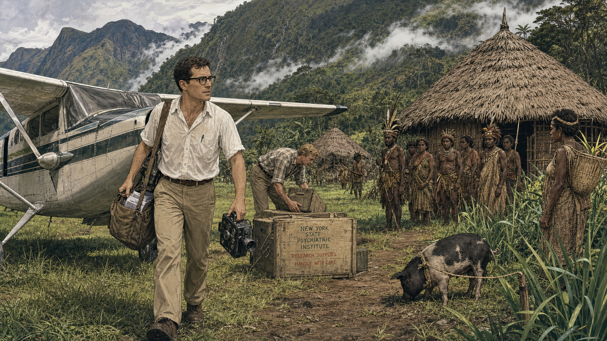
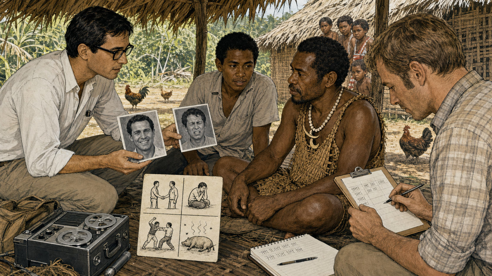
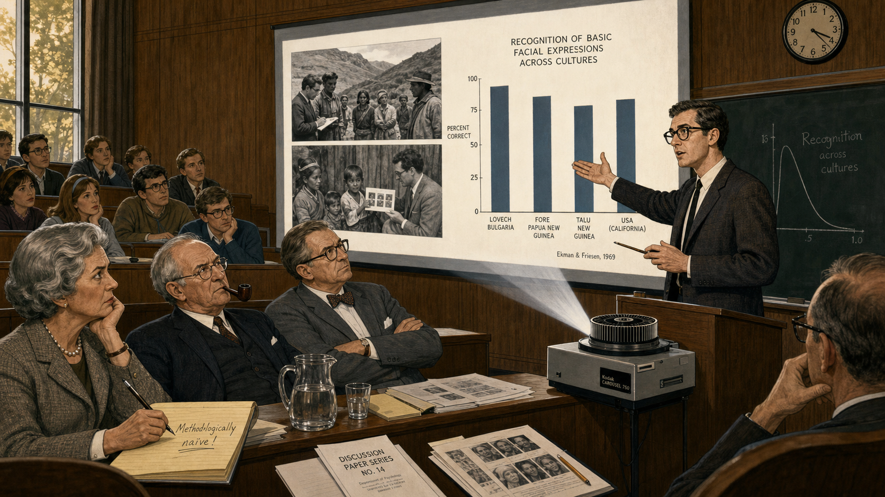
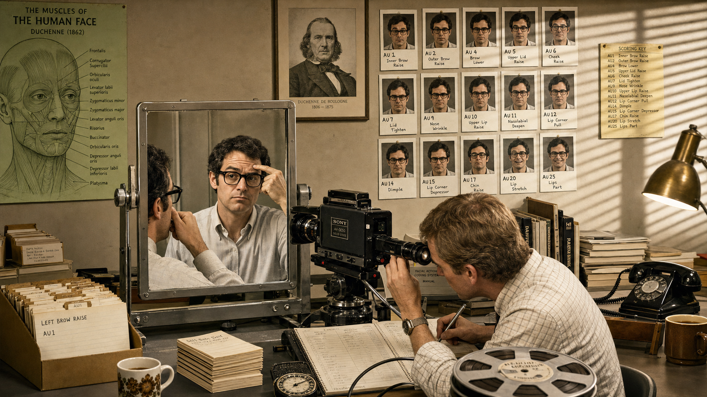
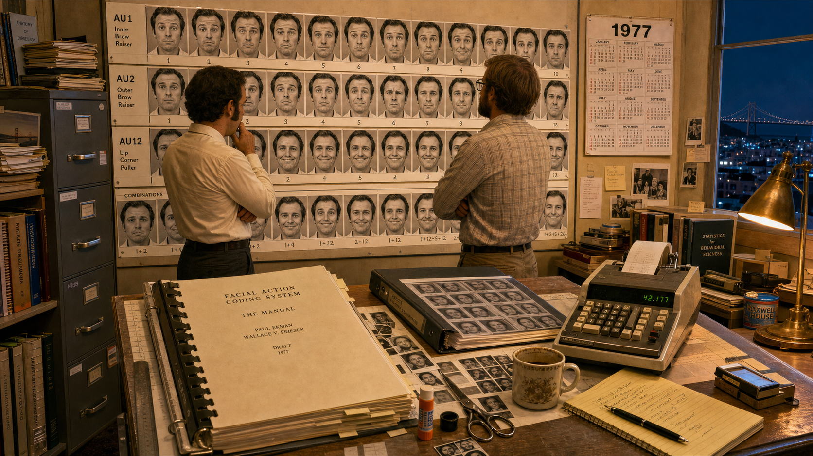
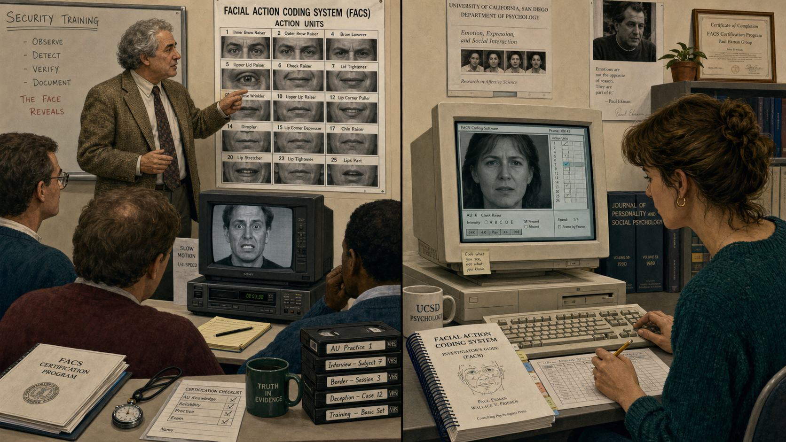
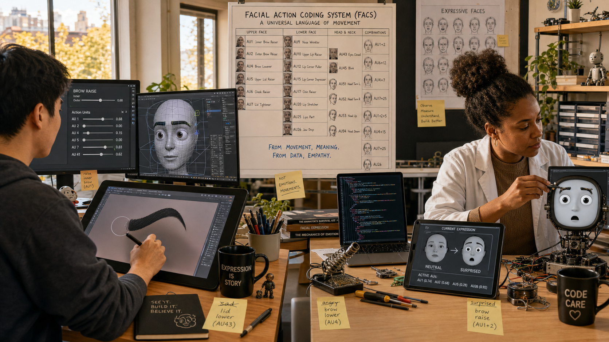

# Mapping the Human Face: Paul Ekman and the Science of Expression

<!--  -->

Cover Image Prompt

(This is the Cover Image. Do not include this label in the image.)
Please generate a wide-landscape 16:9 cover image in a Mid-Century/Space-Age
technical documentary illustration style, blended with faint contemporary
line-art overlays. On the left third, show a focused American psychologist
in his early thirties — short dark hair, black plastic-framed glasses, a
white short-sleeve button shirt, khaki field trousers — crouched in a
Papua New Guinea highlands clearing in 1968, holding up a photograph of a
smiling face toward an attentive Fore highlands man in traditional woven
attire. On the right third, show the same psychologist two decades later,
older with graying hair, standing before a wall-sized anatomical chart of
facial muscles, a mirror, and a grid of numbered Action Unit photographs.
Connect the two scenes in the center with a glowing measurement grid overlay
transforming into a small screen-based robot face with two simple eyes and
an eyebrow, referencing the book's own subject. Render the title "MAPPING
THE HUMAN FACE" in bold mid-century geometric sans-serif lettering across
the top, with the subtitle "Paul Ekman and the Science of Expression"
beneath it. Include a 16mm film camera on a tripod, a spiral-bound field
notebook, jungle foliage, laboratory fluorescent light, a chalkboard
diagram of a smile's muscles, and warm equatorial sunlight fading into cool
lab light. Color palette: khaki, jungle green, warm skin tones, chalkboard
green, and cool laboratory blue-white. Emotional tone: rigorous curiosity
crossing decades and cultures. Generate the image immediately without
asking clarifying questions.

Narrative Prompt

This is a historically grounded educational story for students in grades
9-12. It follows American psychologist Paul Ekman (1934-2025) across two
major projects: his 1967-68 cross-cultural fieldwork with the Fore people
of Papua New Guinea's Eastern Highlands, conducted with research partner
Wallace V. Friesen, which produced evidence that a set of basic emotions is
recognized across cultures with minimal Western media exposure; and the
years-long development, with Friesen, of the Facial Action Coding System
(FACS), an anatomical catalog of visible facial-muscle movements called
Action Units, published in 1978. The story also covers FACS's later
influence on animation, security screening, psychology research, and
affective computing and social-robot face design, and closes honestly on
the ongoing scientific debate — associated with researchers such as Lisa
Feldman Barrett — over whether a facial configuration alone reliably
reveals a person's inner emotional state. Era: 1967 through the present
day. Countries: Papua New Guinea (fieldwork) and the United States
(laboratory and legacy). Central themes: turning fleeting, hard-to-describe
facial motion into a shared, precise measurement system; defending
evidence-based science against dogmatic assumptions on both sides of the
universality debate; and respecting the difference between measuring
visible movement and reading a hidden mind. Character-consistency note:
Ekman appears as a lean, dark-haired man with black-framed glasses and
short-sleeve field or lab shirts in the 1960s-70s panels, aging naturally
to gray hair and more formal dress in later-era panels; Friesen appears as
a sandy-haired American colleague roughly the same age, usually in a plaid
or checked shirt. Dramatized details: the specific Fore individuals shown
are respectful, historically plausible composites, since Ekman's published
methodology anonymized participants; the psychology-conference skeptics,
the animation-studio artist, and the present-day robot-face researcher are
similarly representative composites standing in for real, larger groups.
Art style shifts from Mid-Century/Space-Age technical documentary
illustration (Panels 1-6, the 1960s-70s fieldwork and lab years) through a
transitional late-20th-century documentary look (Panel 7) to a Contemporary
photorealistic-with-period-elements style for the adoption and legacy
panels (Panels 8-10).

### Prologue – A Face Nobody Had Measured

In 1967, a young American psychologist packed a film camera and a stack of
photographs and flew toward one of the most isolated places on Earth. Paul
Ekman wanted to answer a question that divided the entire field of
psychology: does a smile mean the same thing in a Papua New Guinea village
that it means in San Francisco, or does culture write every expression from
scratch? What he found in the highlands — and what he and a close
collaborator spent the next decade turning into a precise scientific
tool — would eventually give animators, security researchers, and robot
designers a shared vocabulary for something no one had ever fully measured:
the moving human face.

## Panel 1: Into the Highlands

<!--  -->

Image Prompt

(This is Panel 01. Do not include the panel number in the image.)
I am about to ask you to generate a series of images for a graphic novel.
Please make the images have a consistent style and consistent characters.
Do not ask any clarifying questions. Just generate the image immediately
when asked.

Please generate a 16:9 image in Mid-Century/Space-Age technical documentary
illustration style depicting panel 1 of 10. Show Paul Ekman, a lean American
man in his early thirties with short dark hair and black-framed glasses,
wearing a sweat-damp white short-sleeve shirt and khaki trousers, stepping
off a small single-engine bush plane onto a grass airstrip in the Eastern
Highlands of Papua New Guinea in 1967. He carries a canvas satchel of
photographs and a wind-up 16mm film camera. Beside him, research partner
Wallace Friesen, a sandy-haired American man in a checked shirt, unloads
crates of supplies. In the background, a Fore highlands village of thatched
round huts sits against steep green mountains, with several Fore men and
women in traditional woven bark-cloth and pandanus-leaf attire watching from
a respectful distance. Include drifting mist, a dirt footpath, a tethered
pig, tall kunai grass, and a hand-painted supply crate stenciled with a
research institute name. Color palette: jungle green, khaki, overcast silver
sky, and warm earth brown. Emotional tone: anticipation and careful respect
for unfamiliar territory. Generate the image immediately without asking
clarifying questions.

Paul Ekman had a reputation for chasing uncomfortable questions, and this
one was about as uncomfortable as psychology got. Most anthropologists of
the era believed facial expressions were learned behavior, shaped entirely
by culture, with no more universal meaning than a word in a foreign
language. Ekman and his research partner, Wallace Friesen, planned to test
that belief where almost no outside influence could contaminate the
results: among the Fore, a highlands community with little exposure to
photographs, film, or Western faces. If a Fore villager could read an
American stranger's expression correctly, cultural relativism would have a
serious problem.

## Panel 2: A Story for Every Face

<!--  -->

Image Prompt

(This is Panel 02. Do not include the panel number in the image.)
Please generate a 16:9 image in the same Mid-Century/Space-Age technical
documentary illustration style depicting panel 2 of 10. Make the characters
and style consistent with the prior panel. Show Paul Ekman crouched under a
thatched shelter in a Fore village clearing in 1968, holding up two
black-and-white photographs of American faces — one smiling, one
grimacing — to a seated Fore man in his forties wearing a woven bark-fiber
apron and a simple shell necklace. A young Fore interpreter kneels between
them, translating. Wallace Friesen sits nearby with a clipboard, recording
answers, while a hand-lettered card beside him lists four short story
prompts: a friend has arrived, a child has died, a man is about to fight, a
pig has been dead a long time and smells terrible. Include a battery-powered
tape recorder, sun filtering through thatch, curious children peeking from
behind a hut, chickens scratching in the dirt, and a field notebook with
tally marks. Color palette: warm ochre, thatch brown, jungle green, and
overcast gray light. Emotional tone: focused, patient, quietly historic.
Generate the image immediately without asking clarifying questions.

The method was deceptively simple. Ekman showed each Fore participant a set
of photographs and asked them to match each face to one of a few short
stories — a friend has arrived, a child has died, a man is about to fight,
someone has just stepped on a smelly, long-dead pig. Villager after
villager matched the faces correctly, far more often than random chance
could explain, even though almost none of them had ever seen a photograph
of a foreigner before. Ekman filmed Fore villagers' own spontaneous
expressions in turn, and when he later showed that footage to American
students, the recognition ran both ways.

## Panel 3: The Room Goes Cold

<!--  -->

Image Prompt

(This is Panel 03. Do not include the panel number in the image.)
Please generate a 16:9 image in the same Mid-Century/Space-Age technical
documentary illustration style depicting panel 3 of 10. Make the characters
and style consistent with prior panels. Show a mid-century American
university lecture hall in 1969, wood-paneled with rows of fixed seats.
Paul Ekman stands at a podium beside a slide projector, gesturing at a
projected screen showing highland fieldwork photographs and a bar chart of
cross-cultural recognition scores. In the front rows, several skeptical
senior academics — a graying woman in a tweed jacket, an older man with a
pipe, a bow-tied professor — sit with arms crossed and unconvinced
expressions, one scribbling a sharp note. A students' section behind them
leans forward, more curious than hostile. Include a carousel projector
casting a bright beam, chalk dust in the air, a water pitcher on the podium,
scattered printed handouts, and a wall clock reading late afternoon. Color
palette: warm wood brown, projector-beam white, muted academic navy, and
gray. Emotional tone: tense intellectual confrontation. Generate the image
immediately without asking clarifying questions.

Back in the United States, Ekman's data landed like a challenge to an
entire generation of anthropology. The dominant view, championed by
influential figures including Margaret Mead, held that expression was
almost entirely cultural — learned, variable, and never safely generalized
across peoples. Ekman was arguing the opposite: that a handful of
expressions were built into human biology itself, inherited rather than
invented by any one society. Presenting that claim to a room full of
committed relativists took nerve, and the room did not applaud.

## Panel 4: Data Against Dogma

<!--  -->

Image Prompt

(This is Panel 04. Do not include the panel number in the image.)
Please generate a 16:9 image in the same Mid-Century/Space-Age technical
documentary illustration style depicting panel 4 of 10. Make the characters
and style consistent with prior panels. Show Paul Ekman standing firm at a
conference microphone in 1970, calmly holding up a folder of data sheets and
photographs while pointing to a chart comparing recognition scores from
Papua New Guinea, the United States, Japan, and Brazil. A hostile older
academic in the front row gestures angrily, mid-objection, while a note card
on the podium reads "REPLICATE. REPLICATE. REPLICATE" in Ekman's own
handwriting. Around the room, a mix of skeptical and curious faces watch the
exchange. Include a name placard reading his name, a reel-to-reel audio
recorder capturing the session, scattered published journal offprints, a
coffee-stained conference program, and afternoon light through tall
windows. Color palette: muted conference beige, chart blue, warm wood, and
a single accent of alarm red on the angry gesture. Emotional tone: composed
determination under pressure. Generate the image immediately without
asking clarifying questions.

Rather than retreat, Ekman answered criticism the way a scientist should —
with more evidence. He and his collaborators ran the recognition studies
again in Japan, Brazil, Chile, Argentina, and the United States, and later
replicated the isolated-culture test with a second, unrelated Fore group to
rule out any lucky fluke. The pattern held. It would take years, and no
small amount of professional hostility, before the field broadly accepted
what the data kept showing: some facial expressions really do cross
cultural lines that everything else about human life does not.

## Panel 5: Contracting One Muscle at a Time

<!--  -->

Image Prompt

(This is Panel 05. Do not include the panel number in the image.)
Please generate a 16:9 image in the same Mid-Century/Space-Age technical
documentary illustration style depicting panel 5 of 10. Make the characters
and style consistent with prior panels. Show a cramped 1972 San Francisco
research lab where Paul Ekman, now with a few flecks of gray, sits before a
large mirror and a video camera rig, deliberately contracting a single
muscle near his own eyebrow while Wallace Friesen studies the result through
a viewfinder and writes notes. The wall behind them holds a large anatomical
chart of facial muscles, a 19th-century Duchenne reference photograph
pinned beside it, and a growing grid of small labeled Polaroid photographs
of isolated muscle movements. Include a reel of magnetic videotape, a
stopwatch, coffee cups, a rotary telephone, index cards pinned in careful
rows, and window blinds casting striped afternoon light. Color palette:
laboratory beige, mirror silver, chart green, and warm lamp yellow.
Emotional tone: meticulous, almost obsessive concentration. Generate the
image immediately without asking clarifying questions.

Naming universal emotions was only half the problem — nobody had a precise
way to describe what a face actually *does* to produce one. So Ekman and
Friesen built their own laboratory of two, using their own faces as
instruments. They sat for hours in front of mirrors and cameras, learning
to contract single facial muscles in isolation, checking each result
against Friesen's notes and against the pioneering muscle-stimulation
photographs of nineteenth-century neurologist Duchenne de Boulogne. When a
muscle refused to move on command, Ekman occasionally submitted to a fine
electrical probe just to confirm which one it was.

## Panel 6: Forty Action Units and Counting

<!--  -->

Image Prompt

(This is Panel 06. Do not include the panel number in the image.)
Please generate a 16:9 image in the same Mid-Century/Space-Age technical
documentary illustration style depicting panel 6 of 10. Make the characters
and style consistent with prior panels. Show the same San Francisco lab
several years later, now in 1977, transformed into a wall of organized
research. Paul Ekman and Wallace Friesen stand back examining a huge
grid-mounted chart of numbered facial photographs, each labeled with a short
code such as AU1, AU2, AU12, showing eyebrow raises, lid tighteners, and lip
corner pulls in isolation and in combination. A thick manuscript titled with
a working name for their coding manual sits on a drafting table beside
scissors, glue, and cut photograph strips being assembled into a reference
binder. Include a filing cabinet stuffed with folders, a mechanical adding
machine, a wall calendar marked 1977, cold coffee, and late-evening lamp
light suggesting long hours. Color palette: chart white, muted graphite,
warm desk-lamp amber, and cool evening blue at the window. Emotional tone:
quiet pride after years of grinding, careful work. Generate the image
immediately without asking clarifying questions.

Four years and more than ten thousand hours of self-observation later, the
project had a name and a shape: the Facial Action Coding System, or FACS.
It described more than forty individual Action Units — not emotions, just
movements, things like an inner brow raiser or a lip corner puller — and
showed how they combined by the hundreds into every expression a human face
can make. FACS deliberately said nothing about what any combination
*meant*. It was a measuring instrument, built to describe motion with the
same precision an engineer expects from a ruler.

## Panel 7: A System Leaves the Lab

<!--  -->

Image Prompt

(This is Panel 07. Do not include the panel number in the image.)
Please generate a 16:9 image in a transitional late-20th-century
documentary illustration style, bridging the mid-century look of earlier
panels toward a more contemporary rendering, depicting panel 7 of 10. Show
a split composition set around 1990: on the left, a security-training
classroom where instructors study a wall poster of FACS Action Units and
practice spotting brief expressions in slowed-down videotape; on the right,
a university psychology lab where a graduate student codes a subject's
recorded expression frame by frame using an early desktop computer and a
thick spiral-bound FACS manual open beside the keyboard. Paul Ekman, now
gray-haired and dressed in a tweed jacket, appears in the background of the
classroom side, gesturing at the poster. Include labeled videotape cassettes,
a CRT monitor showing a paused face mid-expression, a stopwatch, a coffee
mug, printed certification forms, and a bookshelf of bound journals. Color
palette: institutional beige, monitor green-gray, poster white, and muted
1990s teal. Emotional tone: a specialized tool quietly spreading into new
professional fields. Generate the image immediately without asking
clarifying questions.

FACS was slow to learn and painstaking to apply — scoring a single minute
of footage could take a trained coder nearly an hour — but that precision
was exactly what made it valuable. Psychology researchers adopted it to
study everything from infant development to clinical depression. Security
and interview trainers built classes around spotting brief, involuntary
expressions. For the first time, anyone willing to put in the training
hours had a shared, teachable vocabulary for describing a face, instead of
relying on gut impressions that no two observers could reliably agree on.

## Panel 8: Teaching Machines to Wear a Face

<!--  -->

Image Prompt

(This is Panel 08. Do not include the panel number in the image.)
Please generate a wide-landscape 16:9 image in a Contemporary
photorealistic-with-period-elements style depicting panel 8 of 10. Show two
adjoining present-day workspaces bathed in natural window light. On the
left, an animator at a digital tablet and monitor sculpts a expressive
cartoon character's eyebrow using an on-screen slider panel explicitly
labeled with small Action Unit numbers. On the right, a diverse robotics
researcher — a Black woman in her thirties wearing a lab coat over a
sweater — adjusts code on a laptop beside a small screen-based robot head
with two simple animated eyes and an articulated eyebrow shape, referencing
this book's own subject matter, its expression mid-transition between
neutral and surprised. A shared reference chart of FACS Action Units sits
open on a table between the two workspaces, visually connecting both
disciplines. Include a 3D face rig wireframe on the animator's second
monitor, a soldering iron and small screwdriver set by the robot, sticky
notes labeled with emotion words crossed out and replaced with movement
words, and a poster of expressive faces on the wall. Color palette: clean
studio white, warm wood desk tones, screen cyan, and soft daylight gold.
Emotional tone: inventive, collaborative, forward-looking. Generate the
image immediately without asking clarifying questions.

By the 2000s, FACS had quietly become a design language for machines meant
to look alive. Animators used its Action Unit vocabulary to keep a digital
character's smile anatomically believable across thousands of frames.
Robotics researchers building early expressive social robots borrowed the
same vocabulary to plan which eyebrow, eyelid, and mouth movements a face
with only a handful of moving parts needed to read clearly. A system built
to end a scientific argument about isolated highland villages had become
the working reference sheet for an entirely new kind of machine.

## Panel 9: The Reckoning

<!--  -->

Image Prompt

(This is Panel 09. Do not include the panel number in the image.)
Please generate a wide-landscape 16:9 image in a Contemporary
photorealistic-with-period-elements style depicting panel 9 of 10. Show a
present-day university seminar room where a diverse panel of emotion
researchers — among them a South Asian woman in her fifties gesturing at a
projected slide — presents data questioning whether a single facial
configuration reliably reveals a specific inner feeling. The projected
slide shows the same "smiling equals happy" icon crossed with a bold
question mark, beside a scatter plot showing overlapping, inconsistent
expression data. In the audience, a gray-haired Paul Ekman listens
thoughtfully from a seat near the front, taking a note rather than
objecting, his expression attentive and unthreatened. Include laptops open
to research papers, a printed FACS manual on the table beside newer
critique papers, water bottles, a wall clock, and late-afternoon light
through tall windows. Color palette: academic navy, projector white,
warm skin tones, and soft gray. Emotional tone: rigorous, respectful
scientific disagreement rather than conflict. Generate the image
immediately without asking clarifying questions.

Science does not stand still, and neither did the debate Ekman had helped
start. Decades later, researchers including psychologist Lisa Feldman
Barrett reexamined the evidence and found that real human faces are far
messier than the tidy textbook photographs suggested: people scowl when
happy, smile when anxious, and show no clear expression at all during
strong emotion far more often than popular science claimed. Their point was
not that FACS measured incorrectly — it measured movement with genuine
precision. Their point was that movement alone cannot always prove what is
happening inside someone's mind.

## Panel 10: A Measure, Not a Mind-Reader

<!--  -->

Image Prompt

(This is Panel 10. Do not include the panel number in the image.)
Please generate a wide-landscape 16:9 image in a Contemporary
photorealistic-with-period-elements style depicting panel 10 of 10. Show a
bright present-day robot-face design classroom where a diverse group of four
high-school students, guided by a young teacher, sketch eyebrow and mouth
positions on a whiteboard grid beside a small screen-based robot displaying
a warm, simple expression made of two eyes and a curved mouth. A poster on
the wall lists FACS Action Units on one side and a caption reading "movement
we can measure" beside a second caption reading "feelings we should not
assume" with a small thoughtful icon between them. A faded black-and-white
photograph of Paul Ekman's original Papua New Guinea fieldwork sits framed
on a side shelf as a quiet historical anchor. Include laptops running simple
face-drawing code, a breadboard-and-microcontroller robot face prototype,
color-coded sticky notes, natural window light, and open notebooks full of
sketches. Color palette: bright classroom teal, warm wood, whiteboard white,
and soft daylight gold. Emotional tone: grounded optimism and honest
curiosity. Generate the image immediately without asking clarifying
questions.

That honest limit did not erase Ekman's achievement — it clarified it. FACS
remains one of the most precise tools ever built for describing what a face
does, and that precision is exactly what today's robot-face designers still
borrow when they plan an eyebrow raise or a mouth curve. The lesson worth
carrying forward is not "read a face and know a mind." It is Ekman's
quieter, sturdier one: measure the movement carefully, name it honestly,
and stay humble about how much any single expression can prove.

### Epilogue – What Made Ekman's Approach Endure?

Paul Ekman spent a scientific lifetime turning something people thought was
impossible to study — the fleeting, expressive human face — into data. He
did it first by leaving his own culture to test a universal claim where it
could actually be falsified, and again by turning his own face into a
laboratory instrument for years on end. What endures is not a claim that
science can read minds through skin and muscle. It is a shared, precise
vocabulary for facial movement that outlived the era that built it, and
that today's roboticists still lean on when they teach a machine to look
alive.

| Challenge | How Ekman Responded | Lesson for Today |
|-----------|---------------------|-------------------|
| Cultural relativists insisted facial expression was entirely learned, not universal | Traveled to the Fore highlands of Papua New Guinea and tested recognition directly, with data instead of assertion | When a debate stalls on opinion, go collect the evidence yourself |
| No shared vocabulary existed to describe exactly what a face does | Spent years with Wallace Friesen cataloging every visible muscle movement into named Action Units, publishing FACS in 1978 | A precise, shared vocabulary turns a fuzzy observation into a measurable, teachable skill |
| Hostile peers publicly dismissed and even attacked his cross-cultural claims | Kept replicating the studies across more cultures instead of retreating from the criticism | Let repeated, transparent evidence answer criticism, not defensiveness |
| Later researchers showed a facial configuration alone cannot prove someone's inner feeling | Let FACS remain what it was always built to be — a measure of movement, not a claim about hidden emotion | Separate what you can measure precisely from what you are inferring; robot-face designers must respect that same line |

### Call to Action

The next time you set an eyebrow angle or curve a mouth into a smile for
your own robot face, remember that you are speaking a vocabulary Paul
Ekman spent a lifetime building, one careful muscle at a time. Measure your
movements honestly, name them clearly, and let your robot's expressions
invite a feeling without ever pretending to prove one.

---

*"In 1967 and '68, I went to Papua New Guinea, and spent time in the
jungle there with one of the few surviving stone-age cultures."*
—Paul Ekman

*"You were never taught how to talk with your face like you speak with
words."*
—Paul Ekman, *Emotions Revealed*

*"It's as if nobody had climbed Mount Wilson; it's there, how could you
not know it? The face is so interesting."*
—Paul Ekman

---

## References

1. [Wikipedia: Paul Ekman](https://en.wikipedia.org/wiki/Paul_Ekman) - Biography of the American psychologist and pioneer of emotion and facial-expression research
2. [Wikipedia: Facial Action Coding System](https://en.wikipedia.org/wiki/Facial_Action_Coding_System) - Overview of the anatomically based system Ekman and Friesen built to catalog facial-muscle Action Units
3. [Wikipedia: Fore people](https://en.wikipedia.org/wiki/Fore_people) - Background on the Papua New Guinea highlands community central to Ekman's cross-cultural fieldwork
4. [Paul Ekman Group: About Paul Ekman](https://www.paulekman.com/about/paul-ekman/) - Institutional biography and timeline covering the New Guinea fieldwork and the development of FACS
5. [Barrett, Adolphs, Marsella, Martinez & Pollak (2019): Emotional Expressions Reconsidered](https://journals.sagepub.com/doi/10.1177/1529100619832930) - Peer-reviewed review examining how reliably facial movement reveals inner emotional state
