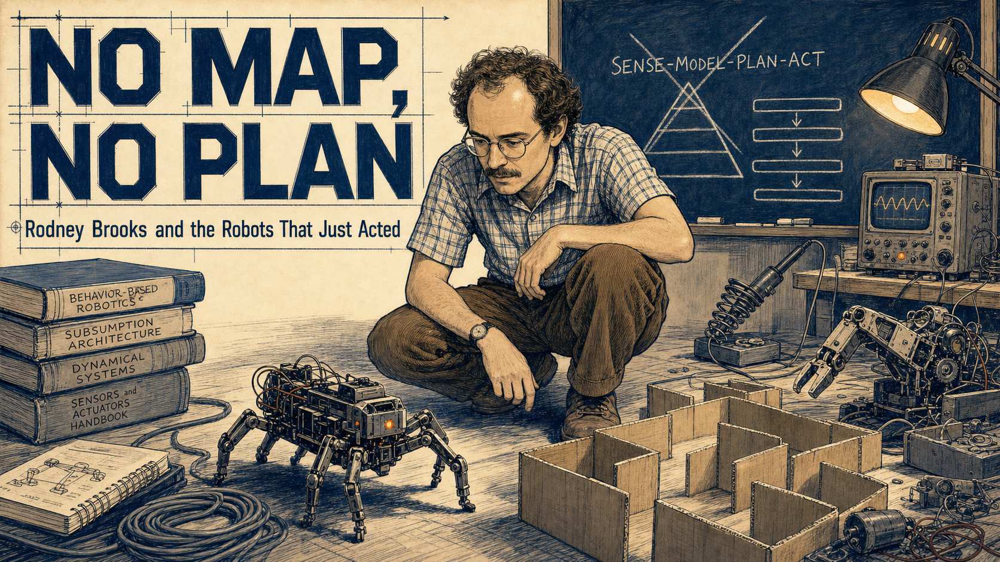
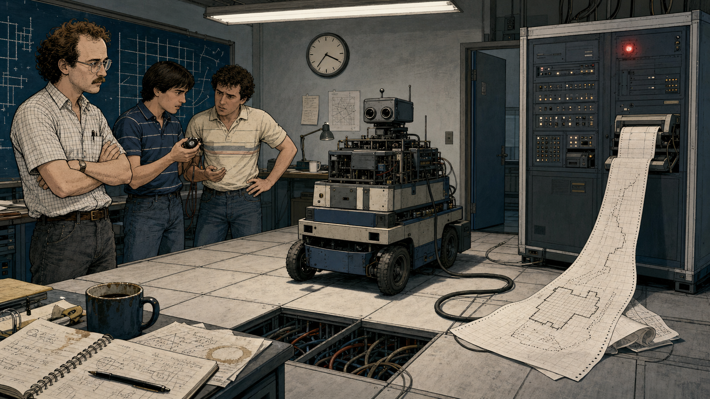
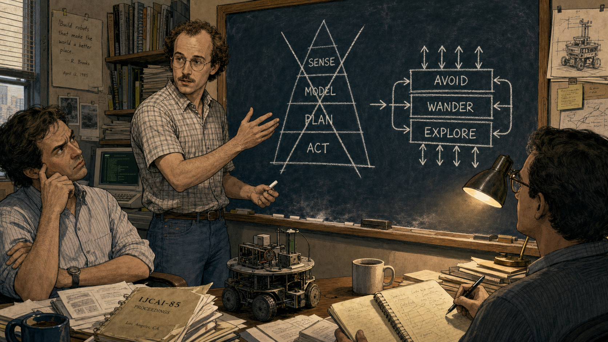
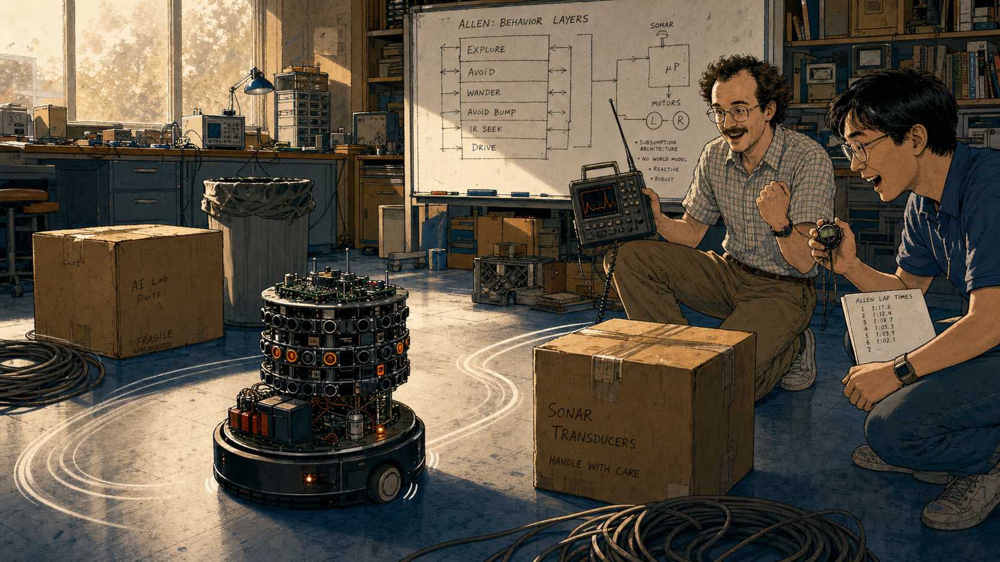
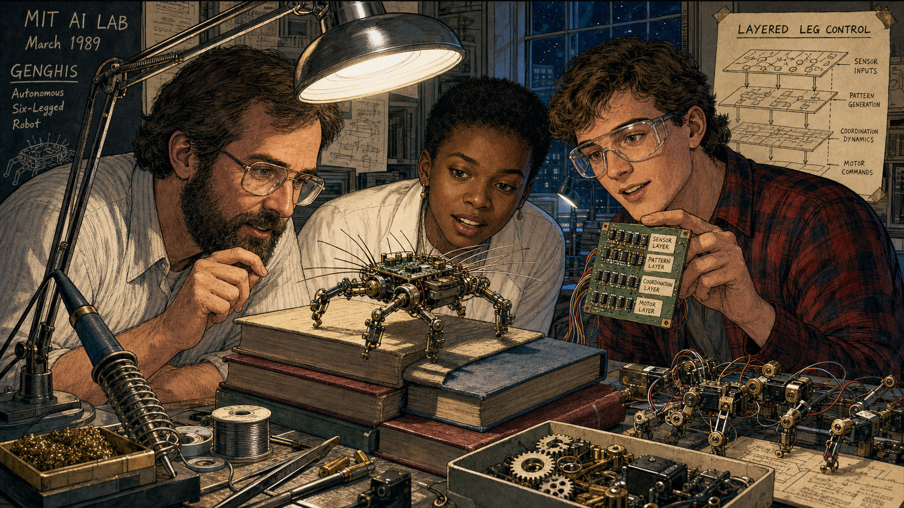
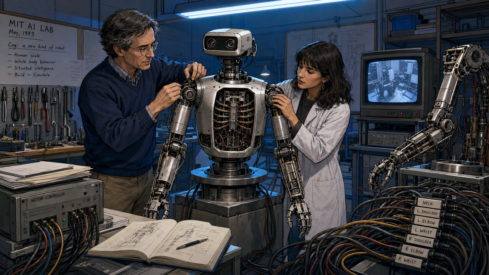
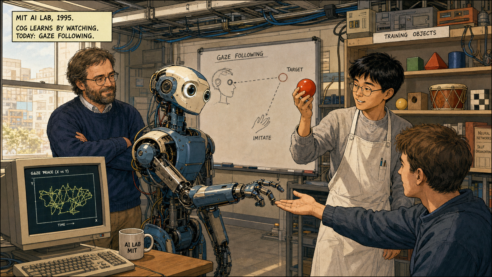
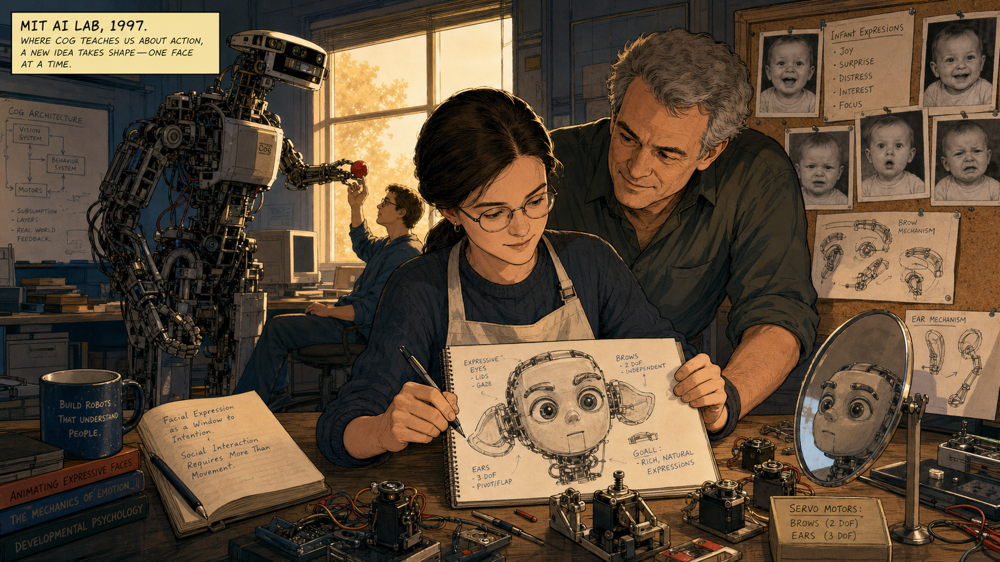
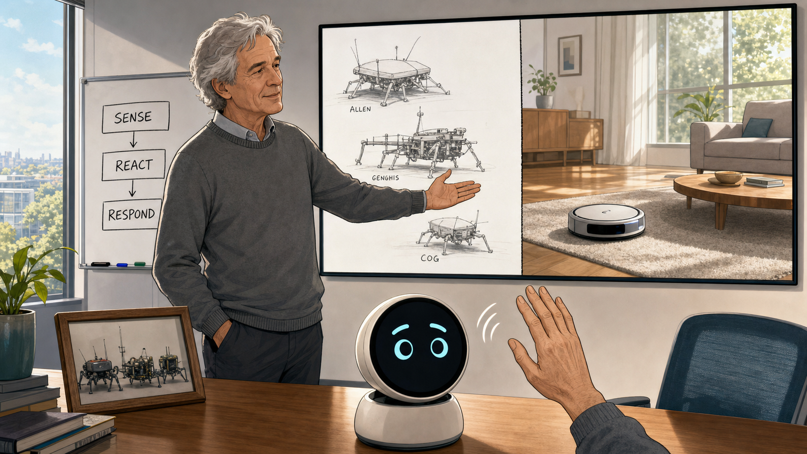

# No Map, No Plan

<!--  -->

Cover Image Prompt

(This is the Cover Image. Do not include this label in the image.)
Please generate a wide-landscape 16:9 cover image in a Space-Age,
NASA-adjacent technical-illustration style with clean cosmic-blue linework
over cream paper. Center a lean man in his mid-thirties with curly brown
hair receding at the temples, a light mustache, wire-rimmed glasses, a
checked short-sleeve shirt, and corduroy trousers — Rodney Brooks — crouched
on a cluttered lab floor at eye level with a small six-legged insect-like
robot. The robot scuttles past a coiled cable and a stack of manuals toward
a cardboard box maze, no computer screen or wall map in sight. Behind him,
a chalkboard shows a crossed-out pyramid diagram labeled "SENSE-MODEL-PLAN-ACT"
next to a hand-drawn stack of simple horizontal layers. Include an
oscilloscope glowing faintly, a soldering iron resting in its stand, loose
gears, a half-disassembled robot arm on a workbench, and warm task-lamp
light cutting through the dim room. Render the title "NO MAP, NO PLAN" in
bold geometric technical-illustration lettering with the subtitle "Rodney
Brooks and the Robots That Just Acted" beneath it. Color palette: cosmic
blue, warm amber lamp light, cream, graphite gray, and a spark of orange
from the robot's indicator light. Emotional tone: quiet defiance turning
into confident discovery. Generate the image immediately without asking
clarifying questions.

Narrative Prompt

This is a historically grounded educational case study for students in
grades 9-12. It follows Rodney Brooks (born 1954 in Adelaide, Australia)
from his arrival on the MIT Artificial Intelligence Laboratory faculty in
1984 through the 1986 and 1990 papers that argued against symbolic,
map-and-plan robotics, the insect-like robots Allen, Herbert, and Genghis
built to test his "subsumption architecture," the 1993 start of the
humanoid torso Cog, graduate student Cynthia Breazeal's parallel work that
grew into the social robot Kismet, and Brooks's 1990 co-founding of iRobot,
maker of the Roomba. The story compresses roughly two decades of lab work
into eight panels and dramatizes some dialogue and lab-meeting scenes for
narrative clarity — the core sequence of events, papers, and robots is
factual. Brooks appears consistently across panels 1-7 as a lean man with
curly brown hair receding at the temples, a light mustache, wire-rimmed
glasses, and a checked short-sleeve shirt with rolled cuffs; in panel 8 he
appears older, with graying hair and a simple gray sweater, reflecting the
passage of years into the commercial era. Panels 1 through 6 use a
Space-Age, NASA-adjacent technical-illustration style — cosmic blues,
cluttered lab benches, oscilloscopes, exposed robot mechanics, and
hand-drawn diagrams. Panel 7 begins a visual bridge, and panel 8 shifts to
a cleaner Contemporary editorial-illustration style to mark the move from
lab bench to living room. No real product logos, trademarks, or readable
brand names appear in any image.

### Prologue – The Robot That Wouldn't Move

In the early 1980s, the smartest robots in the world could barely cross a
room. Give one a task, and it would stop, build a map of everything around
it, plan every step in advance, and only then creep forward — often too
slowly to matter, and utterly lost the moment something changed. Rodney
Brooks, a young Australian roboticist who had just joined the MIT
Artificial Intelligence Laboratory, watched this happen again and again and
decided the entire approach was backward. What if a robot didn't need a
map of the world at all? What if the world could simply be its own map,
read fresh through sensors, moment by moment?

## Panel 1: A Demo That Stalls

<!--  -->

Image Prompt

(This is Panel 01. Do not include the panel number in the image.)
I am about to ask you to generate a series of images for a graphic novel.
Please make the images have a consistent style and consistent characters.
Do not ask any clarifying questions. Just generate the image immediately
when asked.

Please generate a wide-landscape 16:9 image in a Space-Age, NASA-adjacent
technical-illustration style depicting panel 1 of 8. The scene is the MIT
Artificial Intelligence Laboratory in Cambridge, Massachusetts, in 1984.
Show a boxy wheeled robot frozen mid-room, a thick cable trailing to a
refrigerator-sized computer cabinet covered in blinking status lights. A
printout unspools onto the floor, covered in coordinate grids and a
half-finished map of the room. Rodney Brooks — a lean man in his early
thirties with curly brown hair receding at the temples, a light mustache,
wire-rimmed glasses, and a checked short-sleeve shirt — stands with arms
crossed, watching two graduate students check a stopwatch and exchange
worried glances. Include a wall clock, a coffee-stained notebook, exposed
wiring under a floor panel, and fluorescent overhead light. Color palette:
cosmic blue, graphite gray, cream, and a single dim red warning light.
Emotional tone: mounting frustration with a slow, over-engineered machine.
Generate the image immediately without asking clarifying questions.

The robot in front of Brooks had every advantage a 1984 laboratory could
offer: a powerful computer, careful programming, and a detailed model of
the room it stood in. It still took nearly a minute to decide whether to
turn left or right, and if someone moved a chair, its whole plan collapsed.
Brooks watched his students recalculate the map for the third time and felt
certain that something fundamental was broken, not in the code, but in the
idea itself.

## Panel 2: The Layered Sketch

<!--  -->

Image Prompt

(This is Panel 02. Do not include the panel number in the image.)
Please generate a wide-landscape 16:9 image in the same Space-Age,
NASA-adjacent technical-illustration style depicting panel 2 of 8. Make
Rodney Brooks consistent with the prior panel: lean, early thirties, curly
brown hair receding at the temples, light mustache, wire-rimmed glasses,
checked short-sleeve shirt. Set the scene at a chalkboard in a cramped MIT
office in 1985. Brooks stands mid-gesture, having just crossed out a tall
pyramid diagram labeled with stacked boxes reading "SENSE," "MODEL,"
"PLAN," and "ACT." Beside it he has drawn a new sketch: short horizontal
layers labeled "AVOID," "WANDER," and "EXPLORE," stacked with small arrows
showing them running side by side instead of in sequence. Two skeptical
colleagues sit nearby, one with raised eyebrows, one taking notes. Include
chalk dust on the floor, a coffee mug, a stack of dog-eared journal papers,
a small model robot on the desk, and warm desk-lamp light. Color palette:
cosmic blue chalk lines, cream chalkboard, warm amber lamp light, and
graphite gray. Emotional tone: stubborn conviction meeting polite doubt.
Generate the image immediately without asking clarifying questions.

Brooks began sketching a different picture: instead of one slow chain of
sense, model, plan, and act, he drew short layers of behavior running side
by side — avoid an obstacle, wander forward, explore what's new — each one
simple enough to react instantly. His 1986 paper called it a "layered
control system," and his colleagues were not convinced a robot could think
without ever building a model of the world. Brooks argued the opposite was
true: the real world already held every detail a robot needed, updated
continuously and for free.

## Panel 3: Allen Learns the Floor

<!--  -->

Image Prompt

(This is Panel 03. Do not include the panel number in the image.)
Please generate a wide-landscape 16:9 image in the same Space-Age,
NASA-adjacent technical-illustration style depicting panel 3 of 8. Make
Rodney Brooks consistent with prior panels. Set the scene in the MIT AI
Lab in 1986. Show a small round wheeled robot called Allen, bristling with
sonar sensor rings like a short cylindrical tower, gliding smoothly around
a cluttered lab floor scattered with boxes, a trash can, and a coiled
cable, without any wall map or overhead camera guiding it. Brooks kneels
nearby with a handheld radio-linked oscilloscope, watching a graduate
student time the robot's laps with a stopwatch. Include a whiteboard in
the background showing simple circuit-like behavior layers, exposed
circuit boards on Allen's top deck, a battery pack, small indicator LEDs,
and afternoon light through a dusty window. Color palette: cosmic blue,
warm amber, cream, and small orange LED accents. Emotional tone: delighted
surprise at something working better than expected. Generate the image
immediately without asking clarifying questions.

Allen, the first robot built to test the idea, carried no map of the lab
and consulted no central plan. Its sonar layer nudged it away from
obstacles, its wander layer kept it moving, and the two behaviors combined
smoothly with no traffic cop coordinating them. Allen crossed the cluttered
floor faster and more reliably than the map-building robots ever had, and
Brooks realized the layers were not a shortcut around intelligence — they
might be closer to what intelligence actually was.

## Panel 4: Genghis Finds Its Legs

<!--  -->

Image Prompt

(This is Panel 04. Do not include the panel number in the image.)
Please generate a wide-landscape 16:9 image in the same Space-Age,
NASA-adjacent technical-illustration style depicting panel 4 of 8. Make
Rodney Brooks consistent with prior panels, now joined by two graduate
students: a Black woman in her twenties with short natural hair and a lab
coat, and a white man in his twenties with a flannel shirt and safety
glasses. Set the scene in the MIT AI Lab in 1989. Show Genghis, a
palm-sized six-legged walking robot bristling with whisker-like antenna
sensors and tiny motors at each leg joint, climbing over a stack of thick
books on the lab floor without stumbling. Brooks and the students watch
closely, one holding a small circuit board with rows of simple labeled
chips. Include a soldering station, loose leg servos on the bench, a
printed diagram of layered leg-control circuits taped to the wall, spare
gears in a tray, and bright overhead task lighting. Color palette: cosmic
blue, brass and copper motor tones, cream, and warm amber highlights.
Emotional tone: focused wonder at emergent, coordinated movement. Generate
the image immediately without asking clarifying questions.

Genghis had six legs, no central leg-coordination program, and no idea in
advance that a stack of books lay in its path. Each leg ran its own simple
layer, reacting to what its own sensors felt, and smooth walking emerged
from all six legs reacting to each other in real time. Brooks's 1990 paper
"Elephants Don't Play Chess" argued this was the whole point: a robot that
senses and reacts fast enough never needs to out-think the world, because
the world is already the most accurate model available.

## Panel 5: Cog Gets a Body

<!--  -->

Image Prompt

(This is Panel 05. Do not include the panel number in the image.)
Please generate a wide-landscape 16:9 image in the same Space-Age,
NASA-adjacent technical-illustration style depicting panel 5 of 8. Make
Rodney Brooks consistent with prior panels, appearing slightly older with
a few gray strands. Set the scene in the MIT AI Lab in 1993. Show Cog: an
armless-no-longer, human-scaled robot torso mounted on a sturdy pedestal,
with two mechanical arms, a simple head with two camera-lens eyes, and a
neck that can turn, its chest paneling open to reveal bundles of wiring
built to echo the geometry of a human ribcage. Brooks and a woman
professor in her thirties with shoulder-length dark hair and a lab coat —
Lynn Andrea Stein — adjust a shoulder joint together while a monitor
nearby displays a simple camera feed. Include hanging tool racks, a
half-built second arm on the bench, motor controller boxes, cable
looms labeled by joint, and cool blue overhead lab light. Color palette:
cosmic blue, brushed metal silver, cream, and warm amber accent light.
Emotional tone: ambitious, careful, and quietly historic. Generate the
image immediately without asking clarifying questions.

In 1993, Brooks and fellow researcher Lynn Andrea Stein started building
Cog: a humanoid torso with arms, a moving head, and camera eyes, mounted
where a person's body would stand. Cog carried no giant world-model either.
Its intelligence was meant to grow the way a human infant's does, through
real physical experience — reaching, missing, adjusting, and reaching
again. "Physical grounding is critical," Brooks explained. "Our goal is to
build a system that can operate in the same world we live in."

## Panel 6: Learning by Looking

<!--  -->

Image Prompt

(This is Panel 06. Do not include the panel number in the image.)
Please generate a wide-landscape 16:9 image in the same Space-Age,
NASA-adjacent technical-illustration style depicting panel 6 of 8. Make
Rodney Brooks and Cog consistent with the prior panel. Set the scene in
the MIT AI Lab in 1995. Show Cog's head turning to follow a bright red
ball held up by a graduate student — a young Asian man in his twenties
wearing round glasses and a lab apron — while Cog's arm reaches toward a
second student's outstretched hand in a simple imitation exercise. Brooks
watches from beside a monitor showing a jittery line graph of the robot's
gaze tracking. Include a shelf of everyday objects used for training —
blocks, a small drum, a soft toy — a whiteboard sketch of a gaze-following
diagram, cable conduits running to the ceiling, and warm midday light
through a lab window. Color palette: cosmic blue, warm amber, cream, and
soft red from the ball. Emotional tone: patient curiosity and quiet
delight at a machine noticing a person. Generate the image immediately
without asking clarifying questions.

Cog learned to follow a moving face with its eyes, reach toward an
offered hand, and mimic a simple gesture, not because anyone programmed
every response in advance, but because layered behaviors let it notice,
react, and adjust through practice. Brooks liked to say he would know the
project had succeeded when students felt bad about switching Cog off at
the end of the day. The lesson was the same one Allen and Genghis had
already taught: treat the world itself as the model, and let behavior
grow from real contact with it.

## Panel 7: A Face of Its Own

<!--  -->

Image Prompt

(This is Panel 07. Do not include the panel number in the image.)
Please generate a wide-landscape 16:9 image in the same Space-Age,
NASA-adjacent technical-illustration style, beginning a slightly cleaner
visual bridge, depicting panel 7 of 8. Show Cynthia Breazeal, a white
woman graduate student in her mid-twenties with straight dark hair pulled
back and round glasses, wearing a lab apron, seated at a workbench near
Cog in the MIT AI Lab in 1997. She sketches a small robot head on a
notepad, drawn with large expressive eyes, movable ears, and eyebrow-like
mechanisms — clearly not humanoid-scaled like Cog behind her, but small
and face-focused. Rodney Brooks, now with visibly graying hair, leans in
from the side, nodding with interest at her sketch. Include Cog's tall
torso visible in the background still reaching toward a student, loose
servo motors for eyebrows and ears laid out on the bench, a mirror propped
up for expression testing, reference photos of infant facial expressions
pinned to a corkboard, and warm late-afternoon light. Color palette:
cosmic blue transitioning toward softer warm tones, cream, and a hint of
coral in the sketch's expression lines. Emotional tone: a new idea taking
root beside an older one. Generate the image immediately without asking
clarifying questions.

Working alongside Cog, graduate student Cynthia Breazeal noticed something
the humanoid torso couldn't quite do: hold a face-to-face conversation the
way an infant holds a caregiver's attention. She began sketching a smaller
robot built almost entirely around expression — movable ears, eyebrows,
and eyes that could shift between curiosity, surprise, and delight. Her
sketch would grow into Kismet, and it carried Brooks's core idea into new
territory: intelligence built from layered, reactive behavior could handle
not just walking and reaching, but feeling understood.

## Panel 8: The Layers Go Home

<!--  -->

Image Prompt

(This is Panel 08. Do not include the panel number in the image.)
Please generate a wide-landscape 16:9 image in a cleaner Contemporary
editorial-illustration style, completing the transition from the lab-bench
look of prior panels, depicting panel 8 of 8. Do not depict logos,
trademarks, or readable brand names. Show Rodney Brooks, now an older man
with graying hair and a simple gray sweater, standing in a bright modern
office beside a large window, gesturing toward a wall display split into
two halves. On one half, faint sketch-lines recall Allen, Genghis, and Cog
from earlier panels. On the other half, a simple round disc-shaped
cleaning robot glides across a sunlit living-room floor at the bottom of
the frame, calmly working around a rug and a low coffee table with no
visible map or remote control. In the foreground, a small round-faced
desktop robot screen shows two simple animated eyes and eyebrows reacting
to a hand waving nearby. Include a whiteboard with three simple labeled
boxes reading "SENSE," "REACT," "RESPOND," a potted plant, soft daylight,
and a framed photo of the original insect-like robots on a shelf. Color
palette: soft daylight white, warm walnut, cyan accent light, and gentle
gray. Emotional tone: quiet pride and durable optimism. Generate the image
immediately without asking clarifying questions.

In 1990, Brooks co-founded iRobot with two of his former students, betting
that layered, reactive behavior could work as well in a customer's living
room as it did in a lab. Their disc-shaped cleaning robot needed no map of
the house and no central plan for the day; it simply sensed a wall, sensed
dirt, and reacted, room by room, the same way Allen once crossed a
cluttered floor. That same idea shows up on a much smaller scale whenever
a robot's eyes, eyebrows, and mouth each react to their own simple
triggers instead of waiting on one giant script to tell them what to feel.

### Epilogue – What Made Brooks Different?

Rodney Brooks did not out-compute the symbolic-AI robots of the 1980s; he
out-argued them, by building small machines that worked while the
map-and-plan robots were still thinking. His layered, behavior-based
approach reshaped robotics research, launched a billion-dollar consumer
robotics company, and gave a young graduate student the foundation to
invent an entirely new field: social robotics. The deepest lesson was
almost embarrassingly simple — a robot does not need to know everything in
advance if it can sense and react fast enough, layer by layer.

| Challenge | How Brooks Responded | Lesson for Today |
|-----------|------------------------|-------------------|
| Symbolic AI robots needed slow, brittle world-models before they could act | Proposed subsumption architecture: simple, parallel behavior layers with no central planner | A few reactive rules can outperform one giant plan when the world keeps changing |
| Critics doubted a robot could be "intelligent" without representing the world internally | Built Allen, Herbert, and Genghis to prove reactive robots could navigate real clutter | Working demonstrations settle arguments that theory alone cannot |
| A robot needed to learn like a person, not just execute pre-written commands | Built Cog as an embodied testbed for gaze, reaching, and imitation through real interaction | Intelligence grows from practice and feedback, not just upfront programming |
| A great lab idea needed to survive contact with real homes and real customers | Co-founded iRobot to bring behavior-based control into an affordable consumer product | Robust, simple designs travel from the workbench to the world more easily than complex ones |

### Call to Action

Every time you wire a robot's eyes to blink at motion or its eyebrows to
lift at a loud sound, you are practicing the same idea Brooks proved on a
cluttered lab floor forty years ago: independently reacting parts, layered
together, can produce behavior richer than any single master plan. Chapters
11 through 13 of this book ask you to build exactly that kind of reactive,
state-based expression — so the next time your face design surprises you
with how alive it feels, you will know exactly why.

---

*"The world is its own best model. It is always exactly up to date. It
always contains every detail there is to be known. The trick is to sense
it appropriately and often enough."*
—Rodney Brooks, "Elephants Don't Play Chess" (1990)

*"Physical grounding is critical. Our goal is to build a system that can
operate in the same world we live in."*
—Rodney Brooks, on the Cog project, MIT News (1994)

*"I'll know we've succeeded when the graduate students feel bad about
switching off the robot."*
—Rodney Brooks, on the Cog project, MIT News (1994)

---

## References

1. [Wikipedia: Rodney Brooks](https://en.wikipedia.org/wiki/Rodney_Brooks) - Biography of the Australian-American roboticist and AI researcher
2. [Wikipedia: Subsumption architecture](https://en.wikipedia.org/wiki/Subsumption_architecture) - The layered, behavior-based robot control system Brooks introduced in 1986
3. [Wikipedia: Cog (project)](https://en.wikipedia.org/wiki/Cog_(project)) - The MIT humanoid robot torso built to test embodied, interaction-driven cognition
4. [MIT News: Brooks tells why he builds robots (1994)](https://news.mit.edu/1994/robot-0629) - Contemporary MIT report on the Cog project with direct quotes from Brooks
5. [Encyclopaedia Britannica: Rodney Brooks](https://www.britannica.com/biography/Rodney-Allen-Brooks) - Overview of Brooks's career, robots, and companies including iRobot
