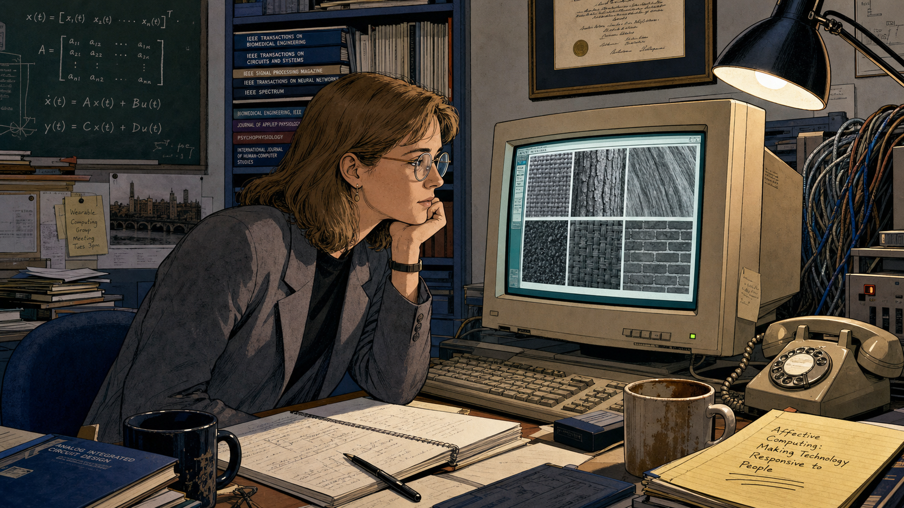
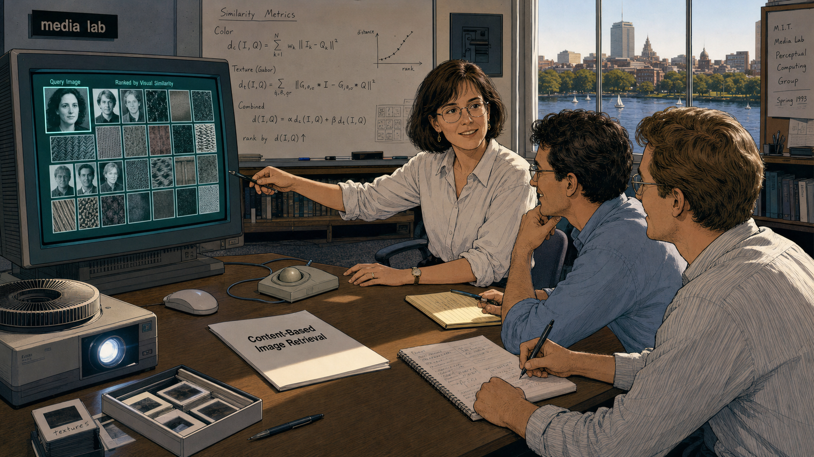
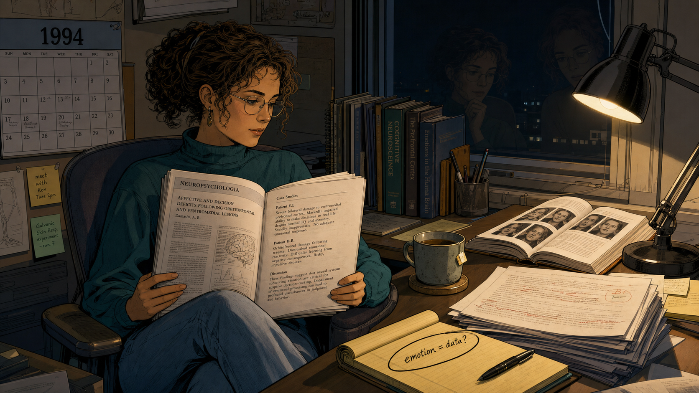
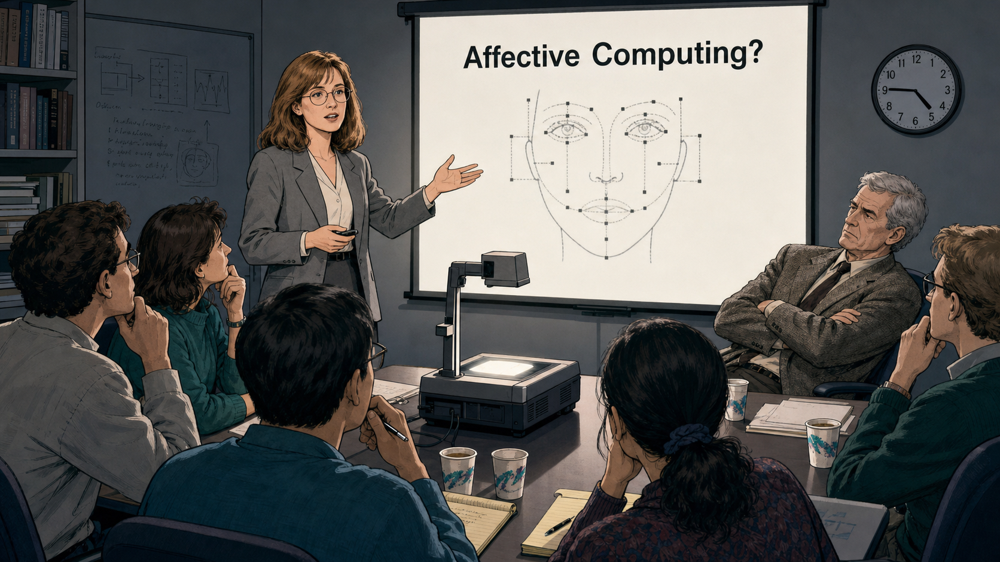
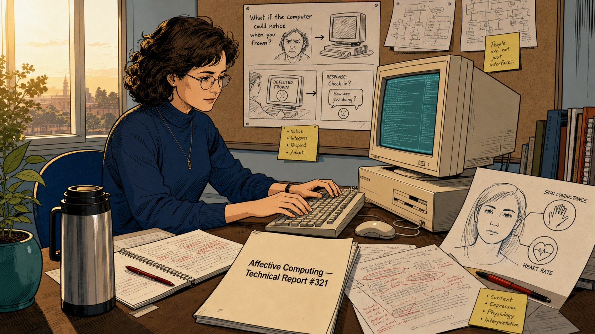
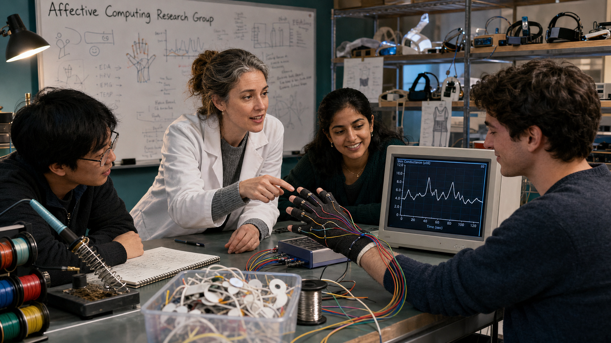
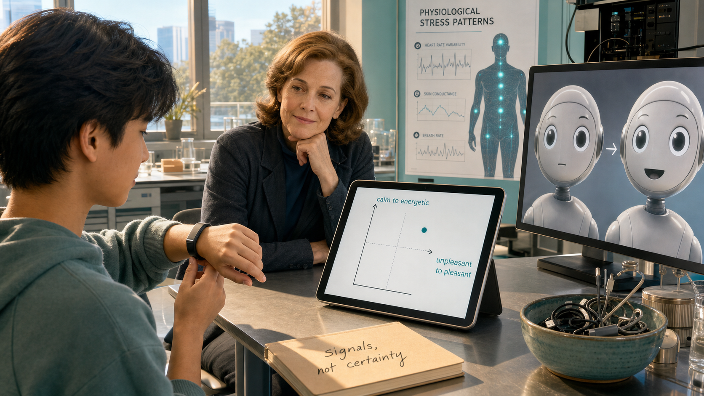
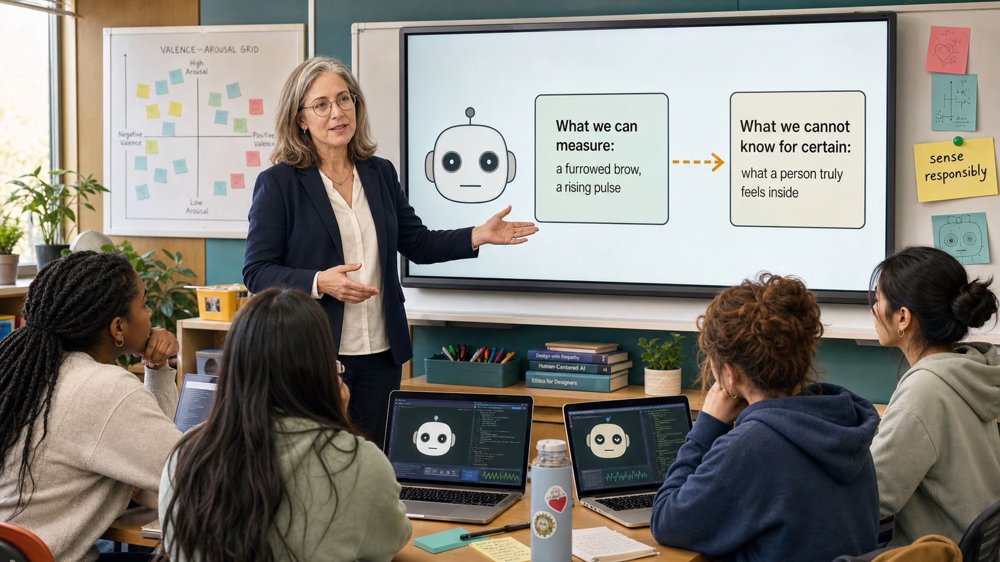

# The Signal Beneath the Noise

<!--  -->

Cover Image Prompt

(This is the Cover Image. Do not include this label in the image.)
Please generate a wide-landscape 16:9 cover image that blends two illustration
styles across a single scene: the left half rendered in clean 1990s
Bell-Labs-style modernist tech-lab illustration, and the right half in a
contemporary photorealistic-with-period-elements style. Center a composed
portrait of Rosalind Picard, a focused white woman in her thirties with
shoulder-length light brown hair, round wire-frame glasses, and a navy blazer
over a cream blouse. On the left, she stands before a boxy CRT monitor
displaying grayscale texture-analysis grids and a wall of technical journals.
On the right, the same woman, now with a few strands of gray in her hair,
stands beside a modern lab bench holding a slim wearable wristband sensor,
its small screen showing a wavy skin-conductance line. Between the two halves,
a translucent human face outline bridges the eras, one side showing a bare
neutral expression, the other overlaid with a soft valence-arousal grid.
Render the title "THE SIGNAL BENEATH THE NOISE" in clean geometric lettering
across the top, with the subtitle "Rosalind Picard and the Birth of Affective
Computing" beneath it. Color palette: cool CRT teal, warm amber, navy, soft
gray, and a single thread of coral connecting both halves. Emotional tone:
quiet scientific conviction bridging two eras. Generate the image immediately
without asking clarifying questions.

Narrative Prompt

This is a historically grounded educational case study for students in
grades 9-12. It follows Rosalind W. Picard (born 1962), an American
electrical engineer, from her early-1990s work in mainstream computer
vision at the MIT Media Lab through her 1995 technical report and 1997 MIT
Press book "Affective Computing," which named and launched that field. The
story covers her founding of the Affective Computing Research Group, the
early wearable physiological sensors her lab built, and the later
real-world application of that research through companies including
Empatica. Themes: intellectual courage in the face of professional
skepticism, the idea that emotion is data rather than noise, and the
ethical boundary between sensing an outward affective signal and claiming
to know someone's true inner feeling. The skeptical colleague's line
"Emotion is just noise — why are you wasting time working on it?" is a
paraphrase of an anecdote Picard has recounted from an early research
meeting; the exact wording is dramatized, but the substance of the
skepticism she faced is well documented. All panels depict Picard with
consistent physical features — light brown hair, round glasses, warm but
serious expression — aging naturally across the decades shown. Art style
shifts deliberately partway through the story: Panels 1-5 use a clean,
late-1980s/1990s Bell-Labs-style modernist tech-lab illustration style;
Panels 6-8 shift to a contemporary photorealistic-with-period-elements
style reflecting modern wearable devices and labs.

### Prologue – The Researcher Who Asked a Different Question

In 1991, Rosalind Picard joined the MIT Media Lab as a rising star in
computer vision, the kind of researcher other engineers wanted on their
team. She built systems that could describe an image's texture in numbers
and search a database by visual similarity, solid, respected work inside
the mainstream of artificial intelligence. Then she asked a question almost
nobody in her field wanted to hear: what if computers that ignore human
emotion are missing something essential, not something irrelevant? That
question would cost her some credibility at first and, within a decade,
create an entire field of research.

## Panel 1: The Young Engineer at the Media Lab

<!--  -->

Image Prompt

(This is Panel 01. Do not include the panel number in the image.)
I am about to ask you to generate a series of images for a graphic novel.
Please make the images have a consistent style and consistent characters.
Do not ask any clarifying questions. Just generate the image immediately
when asked.

Please generate a 16:9 image in a clean 1990s Bell-Labs-style modernist
tech-lab illustration style depicting panel 1 of 8. Show Rosalind Picard, a
focused white woman of 29 with shoulder-length light brown hair, round
wire-frame glasses, and a gray blazer, standing in her MIT Media Lab office
in Cambridge, Massachusetts, in 1991. She examines a boxy beige CRT monitor
displaying a grid of grayscale texture patterns — woven fabric, tree bark,
brick. Include a bookshelf of electrical-engineering journals, a chalkboard
covered in matrix notation, a rotary desk phone, a framed MIT diploma, a
half-finished cup of coffee, and thick woven cables running behind the
monitor. Color palette: cool gray, CRT teal-green, warm amber desk light,
and navy. Emotional tone: quiet competence and early-career momentum.
Generate the image immediately without asking clarifying questions.

Rosalind Picard arrived at the MIT Media Lab in 1991 already an accomplished
engineer, with a degree from Georgia Tech and years designing chips at Bell
Labs behind her. She specialized in signal and image processing, teaching
computers to describe the texture of a photograph in precise mathematical
terms. It was rigorous, respected work, the kind that built careers inside
mainstream artificial intelligence. Nobody around her expected the question
she would soon start asking out loud.

## Panel 2: Photobook and the Language of Texture

<!--  -->

Image Prompt

(This is Panel 02. Do not include the panel number in the image.)
Please generate a 16:9 image in the same clean 1990s Bell-Labs-style
modernist tech-lab illustration style depicting panel 2 of 8. Make the
characters and style consistent with the prior panel. Show Picard, now 31,
demonstrating her Photobook content-based image-retrieval system to two
colleagues in a Media Lab demo room in 1993. A large monitor displays a
grid of photographs — faces, fabric swatches, and textured surfaces —
ranked by visual similarity to a query image highlighted in a corner.
Include a mouse and trackball, a printed research paper titled "Content-Based
Image Retrieval," a slide projector, a whiteboard with similarity-metric
equations, a window showing the Charles River, and two impressed colleagues
in shirtsleeves taking notes. Color palette: cool teal monitor glow, warm
oak furniture, gray carpet, and soft amber lighting. Emotional tone:
professional pride and quiet mastery. Generate the image immediately
without asking clarifying questions.

Her Photobook system let a computer search thousands of images by texture,
shape, and visual similarity rather than by typed keywords, years ahead of
its time. Colleagues respected the work precisely because it stayed
inside familiar territory: cameras, pixels, and measurable patterns. Picard
had built a reputation as a serious signal-processing researcher. That
reputation was about to become the thing she risked.

## Panel 3: A Question Bell Labs Never Asked

<!--  -->

Image Prompt

(This is Panel 03. Do not include the panel number in the image.)
Please generate a 16:9 image in the same clean 1990s Bell-Labs-style
modernist tech-lab illustration style depicting panel 3 of 8. Make the
characters and style consistent with the prior panels. Show Picard alone in
her Media Lab office late at night in 1994, sitting back from her desk with
an open neuroscience journal in her lap. The desk lamp illuminates pages
describing patients whose brain injuries destroyed their ability to feel
emotion alongside their ability to make good decisions. Include a
half-graded stack of student papers, a second open book on facial
expression research, a cooling mug of tea, a dark window reflecting her
thoughtful expression, a wall calendar marked 1994, and a notepad where she
has written "emotion = data?" and circled it. Color palette: warm lamp
amber against cool midnight blue, muted teal accents. Emotional tone:
a quiet, dawning realization. Generate the image immediately without asking
clarifying questions.

Late one night, reading neuroscience research on patients whose brain
injuries had blunted their emotions along with their judgment, Picard saw
something her field had missed. These patients could still reason step by
step, yet without emotional signals they made terrible real-world
decisions, over and over. If emotion helped human judgment work well,
maybe computers built to reason like people needed a way to notice it too.

## Panel 4: "Emotion Is Just Noise"

<!--  -->

Image Prompt

(This is Panel 04. Do not include the panel number in the image.)
Please generate a 16:9 image in the same clean 1990s Bell-Labs-style
modernist tech-lab illustration style depicting panel 4 of 8. Make the
characters and style consistent with the prior panels. Show a Media Lab
conference room in 1995 during a research review. Picard stands at a
projector screen showing a simple diagram of a face with labeled emotional
signals, mid-sentence, while a skeptical senior researcher, a gray-haired
white man in a tweed jacket, leans back with crossed arms and a doubtful
expression. Include five other researchers around a long table with mixed
reactions — one nodding, two exchanging skeptical glances, one taking
careful notes — a slide reading "Affective Computing?" with a question
mark, an overhead projector, foam coffee cups, and a wall clock reading
4:45. Color palette: cool gray, projector-screen white, muted teal, and a
single warm highlight on Picard. Emotional tone: professional tension and
quiet resolve. Generate the image immediately without asking clarifying
questions.

The reaction from colleagues was not warm. One senior researcher told her
flatly that emotion was just noise, and asked why she was wasting her time
on it — a line she has recounted from those early meetings. In a field that
prized cold logic, raising emotion sounded to some like abandoning rigor
altogether. Picard kept building her argument anyway, backing every claim
with data instead of intuition.

## Panel 5: Naming a New Field

<!--  -->

Image Prompt

(This is Panel 05. Do not include the panel number in the image.)
Please generate a 16:9 image in the same clean 1990s Bell-Labs-style
modernist tech-lab illustration style depicting panel 5 of 8. Make the
characters and style consistent with the prior panels. Show Picard at her
desk in 1995, typing at a beige desktop computer, with a printed title page
reading "Affective Computing — MIT Media Lab Technical Report #321" resting
beside the keyboard. Include a stack of draft pages covered in red-pen
edits, a diagram of a face linked to sensor icons for skin conductance and
heart rate, a coffee thermos, a small potted plant, morning light through a
tall window, and a corkboard pinned with sketches of a computer that
notices a frown. Color palette: warm dawn amber, cool teal monitor light,
cream paper, and navy. Emotional tone: determined focus and creative
breakthrough. Generate the image immediately without asking clarifying
questions.

In 1995, Picard published a technical report titled simply "Affective
Computing," laying out her case in careful, measured language: computers
that ignore emotion are working with an incomplete model of the people
they serve. Two years later, MIT Press expanded it into a full book under
the same title. The name stuck, and with it, an entire field of research
now had a founding text and a founder.

## Panel 6: Wires, Skin, and a New Kind of Sensor

<!--  -->

Image Prompt

(This is Panel 06. Do not include the panel number in the image.)
Please generate a 16:9 image in a contemporary photorealistic-with-period-
elements illustration style depicting panel 6 of 8. Make Picard recognizable
from prior panels, now in her late thirties with a few gray strands in her
light brown hair, wearing a lab coat over a sweater. Show her leading a
small research group in a Media Lab workshop around 1999, gathered around a
worktable where a graduate student wears a prototype glove threaded with
thin wires connected to a skin-conductance sensor. A nearby monitor plots a
live wavy line of physiological data. Include a soldering iron, spools of
colored wire, a bin of small electrode pads, a whiteboard labeled
"Affective Computing Research Group," a shelf of early wearable prototypes,
and diverse students from different backgrounds collaborating around the
table. Color palette: workshop teal, warm copper wire, cool steel, and soft
lab-white light. Emotional tone: hands-on curiosity and collaborative
energy. Generate the image immediately without asking clarifying questions.

Picard founded the Affective Computing Research Group and started building
hardware to match her theory. Her students wired gloves and wristbands with
sensors that measured skin conductance, heart rate, and movement, turning
invisible physiological changes into readable data. A computer still could
not feel anything, but it could finally begin to notice what a person's
body was quietly signaling.

## Panel 7: The Wristband That Listened

<!--  -->

Image Prompt

(This is Panel 07. Do not include the panel number in the image.)
Please generate a 16:9 image in the same contemporary photorealistic-with-
period-elements illustration style depicting panel 7 of 8. Make Picard
recognizable from prior panels, now in her fifties, observing from a lab
bench in the mid-2010s. In the foreground, a young person wears a sleek
modern wristband sensor on their wrist while a tablet nearby displays a
simple two-axis chart with "calm to energetic" on one axis and "unpleasant
to pleasant" on the other, with a small dot marking a data point. Include a
second screen showing a friendly round-eyed robot face whose expression
softens in response to the data, a bowl of charging cables, a research
poster about physiological stress patterns, warm daylight from a window,
and a notebook labeled "signals, not certainty" on the desk. Color palette:
soft teal, warm skin tones, cool device silver, and gentle daylight gold.
Emotional tone: careful optimism and real-world usefulness. Generate the
image immediately without asking clarifying questions.

Decades after that first skeptical meeting, wearable sensors born from
Picard's lab were helping people notice their own stress and even alert
some to an oncoming seizure before it struck. The same physiological
signals — skin conductance, heart rate, movement — that once lived only in
research papers now traveled on ordinary wrists. Her ideas also reshaped
how designers built expressive machines, from tutoring software to social
robots that soften their tone when a user's face or voice signals
frustration.

## Panel 8: A Signal Is Not a Mind

<!--  -->

Image Prompt

(This is Panel 08. Do not include the panel number in the image.)
Please generate a 16:9 image in the same contemporary photorealistic-with-
period-elements illustration style depicting panel 8 of 8. Make Picard
recognizable from prior panels, now with fully gray-streaked hair, standing
before a small group of diverse high-school-aged student designers in a
bright present-day classroom. A large screen behind her shows a simple
robot face alongside two labeled boxes: "What we can measure: a furrowed
brow, a rising pulse" and "What we cannot know for certain: what a person
truly feels inside," connected by a cautious dashed arrow rather than an
equals sign. Include laptops with expressive robot-face code on screen, a
poster of a valence-arousal grid, a sticky note reading "sense responsibly,"
warm classroom light, and students nodding thoughtfully. Color palette:
optimistic teal, warm classroom wood tones, soft white, and a single
cautionary amber highlight on the dashed arrow. Emotional tone: thoughtful
responsibility paired with hope. Generate the image immediately without
asking clarifying questions.

Picard has always been careful to draw a line her field sometimes blurs: a
system can sense an outward affective signal, but it cannot read a private
inner feeling with certainty. A furrowed brow might mean frustration, deep
thought, or just bright sunlight in someone's eyes. The responsible
lesson she leaves every new designer is simple — build machines that
respond to what they can actually observe, and stay honest about
everything they cannot.

### Epilogue – What Made Picard's Argument Endure?

Rosalind Picard risked a hard-won reputation in mainstream computer vision
to argue that emotion belonged inside serious engineering, not outside it.
She backed that argument with data, technical reports, a defining book, and
working hardware, not just conviction. Three decades later, affective
computing shapes tutoring software, healthcare wearables, and the
expressive robot faces students design in classrooms today. Her
insistence on a careful, honest boundary between sensing a signal and
claiming to know a feeling remains the field's most important safeguard.

| Challenge | How Picard Responded | Lesson for Today |
|-----------|------------------------|-------------------|
| A respected field treated emotion as irrelevant noise | Read across neuroscience, psychology, and engineering to build a rigorous counter-argument | Real insight often comes from connecting fields that rarely talk to each other |
| Senior colleagues doubted her pivot away from mainstream computer vision | Published a 1995 technical report and a 1997 book backed with data, not just opinion | Evidence, patiently assembled, outlasts an offhand dismissal |
| No shared vocabulary existed for computers and emotion | Coined and defined "affective computing," then founded a research group to build it | Naming a problem precisely is often the first step toward solving it |
| Emotion-sensing technology risks overclaiming what it truly knows | Consistently distinguished a measurable outward signal from a person's private inner feeling | Design the boundary between what a system senses and what it merely infers |

### Call to Action

Every robot face this book teaches you to build will eventually sense
something about the person looking at it — a smile, a furrowed brow, a
long pause before an answer. Design that response with Picard's honesty:
notice the signal, respond helpfully, and never pretend your robot knows
more about someone's heart than it actually does.

---

*"If we want computers to be genuinely intelligent and to interact
naturally with us, we must give computers the ability to recognize,
understand, even to have and express emotions."*
—Rosalind Picard, *Affective Computing* (MIT Press, 1997)

*"We're not known as empathically savvy people. Yet empathy — reading and
adapting behavior to affective cues — is critical."*
—Rosalind Picard, MIT News, December 1997

*"It's easy to make robots look like they are feeling all kinds of
things."*
—Rosalind Picard, MIT News

---

## References

1. [Wikipedia: Rosalind Picard](https://en.wikipedia.org/wiki/Rosalind_Picard) - Biography of the American electrical engineer who founded affective computing
2. [Wikipedia: Affective computing](https://en.wikipedia.org/wiki/Affective_computing) - History and scope of the field Picard named and launched
3. [Wikipedia: Facial Action Coding System](https://en.wikipedia.org/wiki/Facial_Action_Coding_System) - The facial-measurement framework underlying much of affective computing's emotion-recognition research
4. [MIT Media Lab: Rosalind W. Picard](https://www.media.mit.edu/people/picard.html) - Official faculty profile and research overview for the Affective Computing Research Group's founder
5. [MIT Press: Affective Computing](https://mitpress.mit.edu/9780262161701/affective-computing/) - Publisher's page for the 1997 book that named and defined the field
