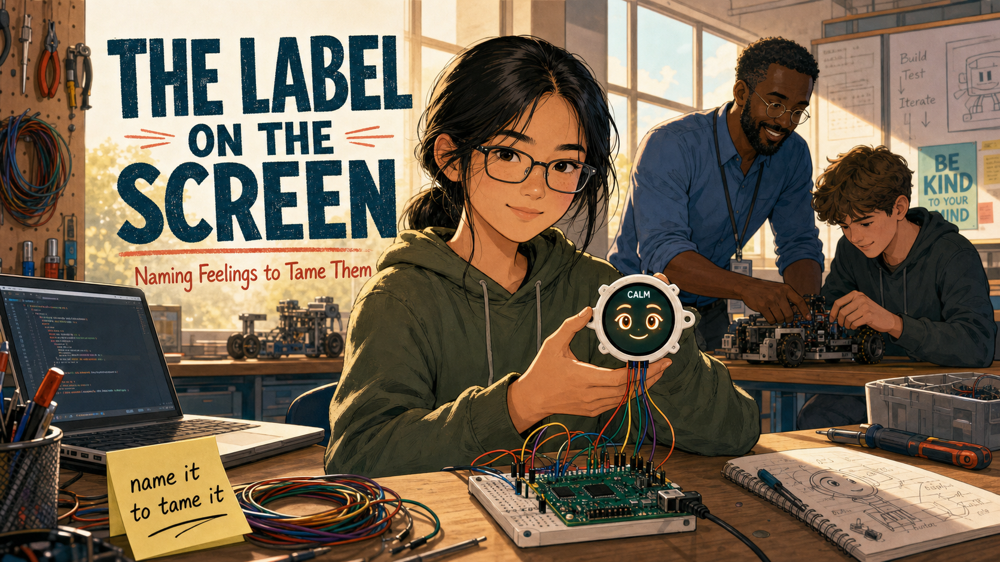
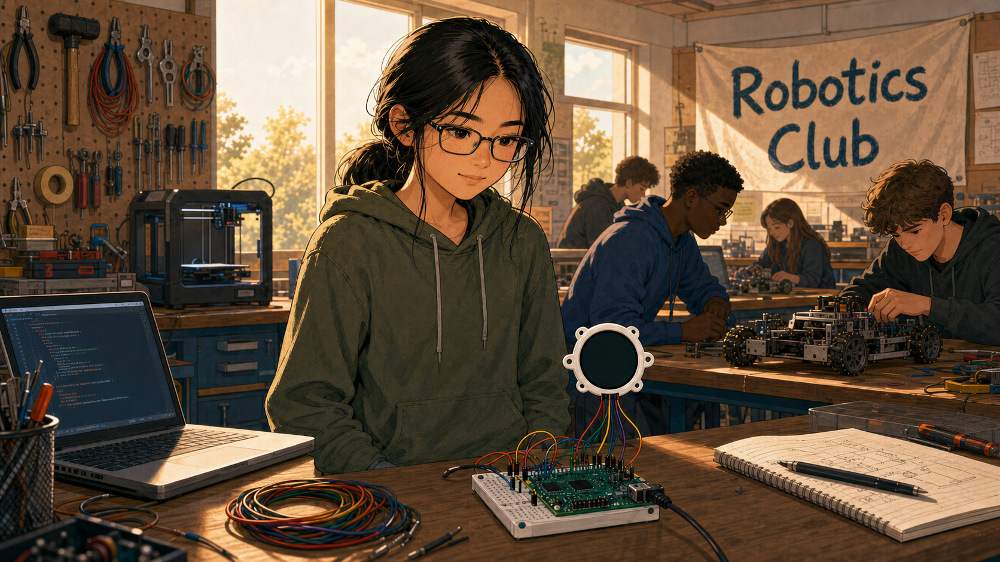
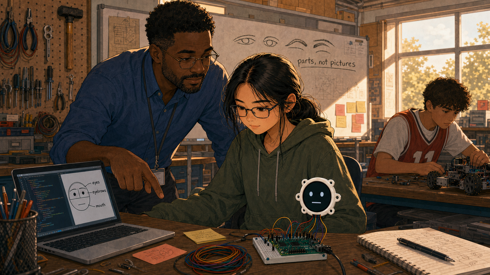
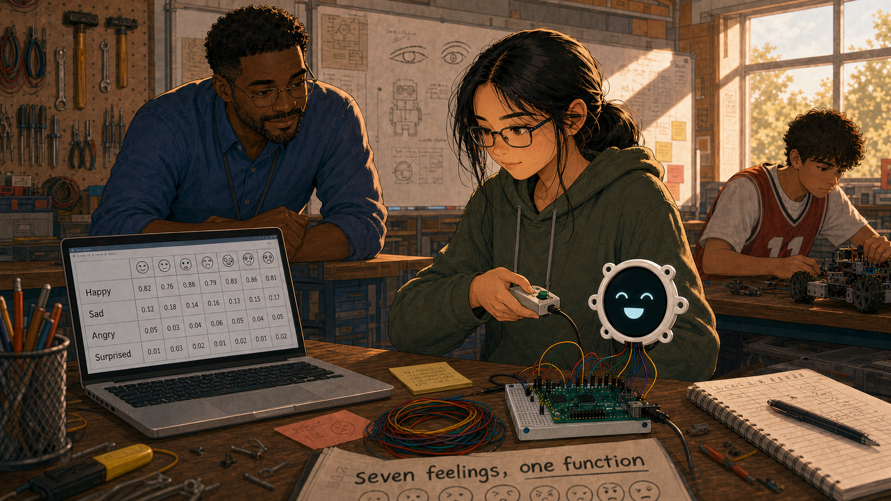
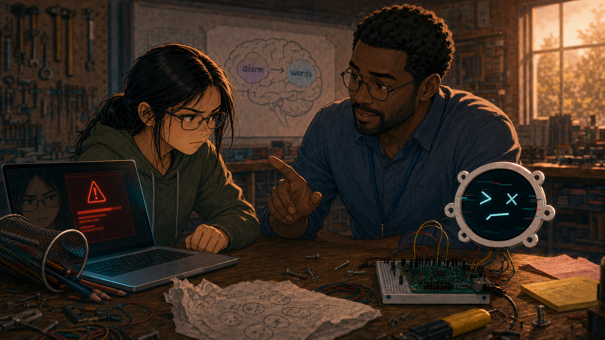
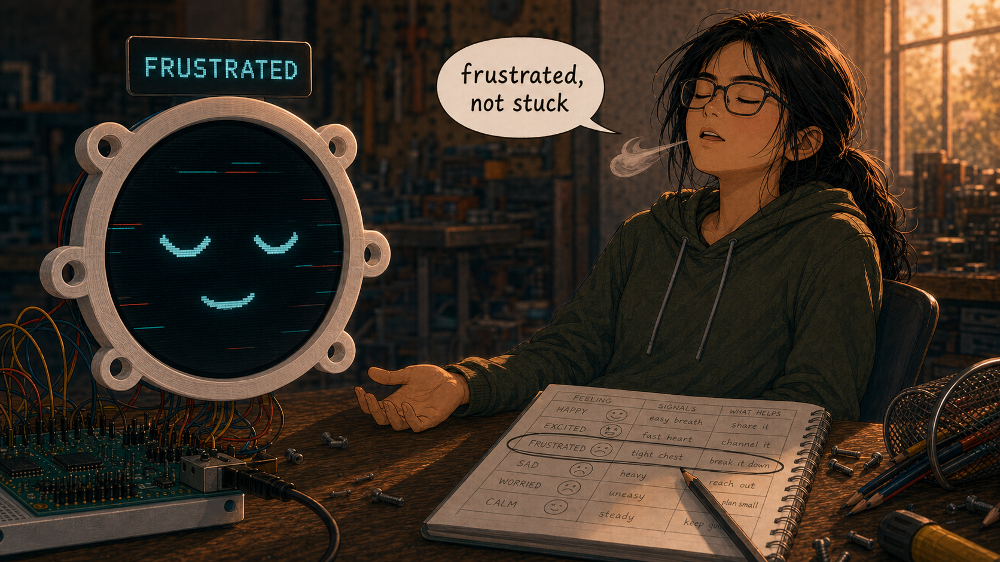
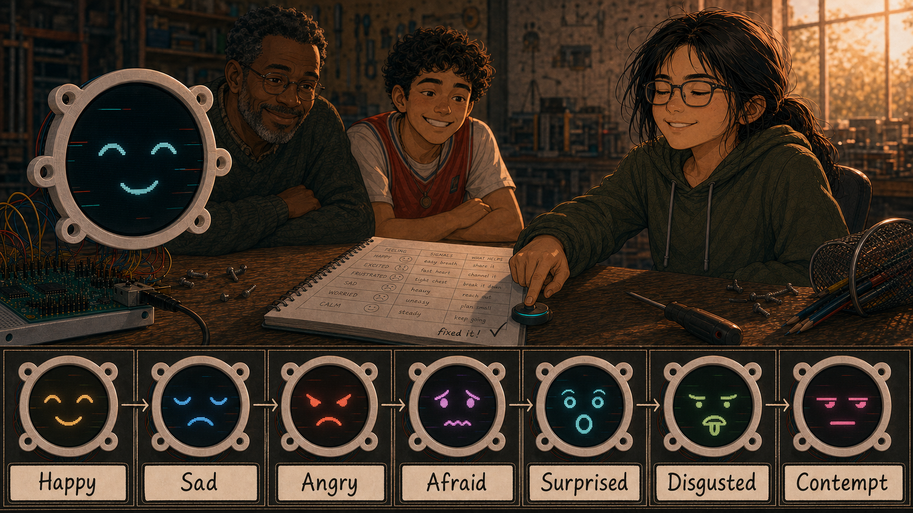
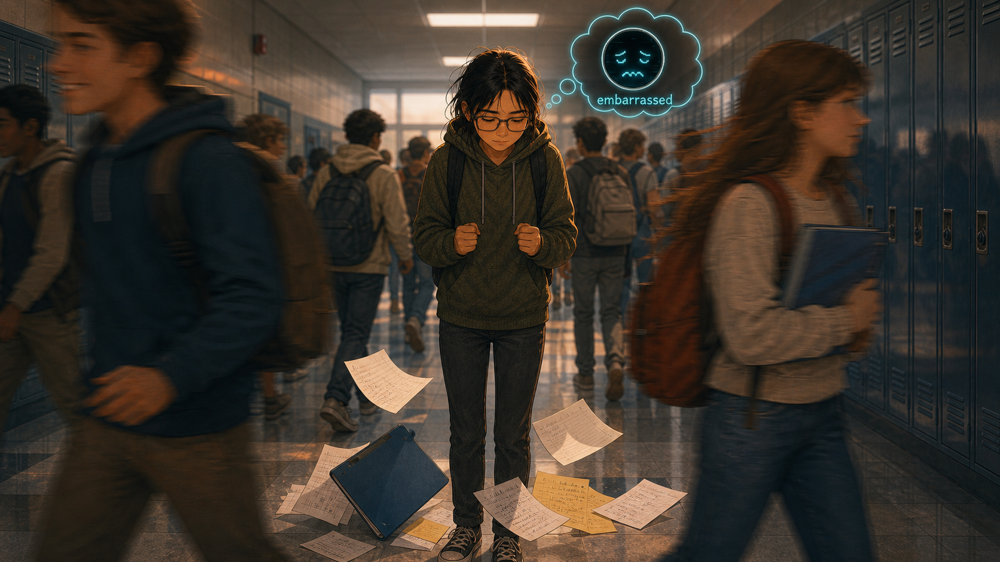
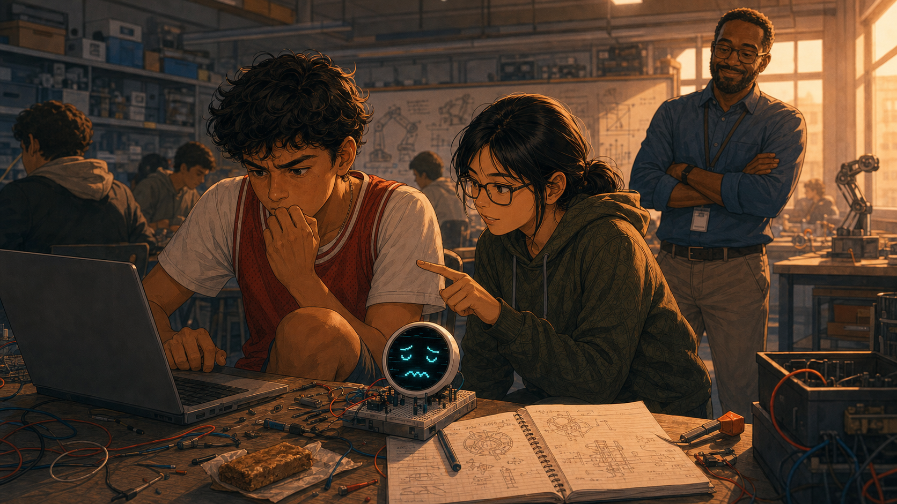
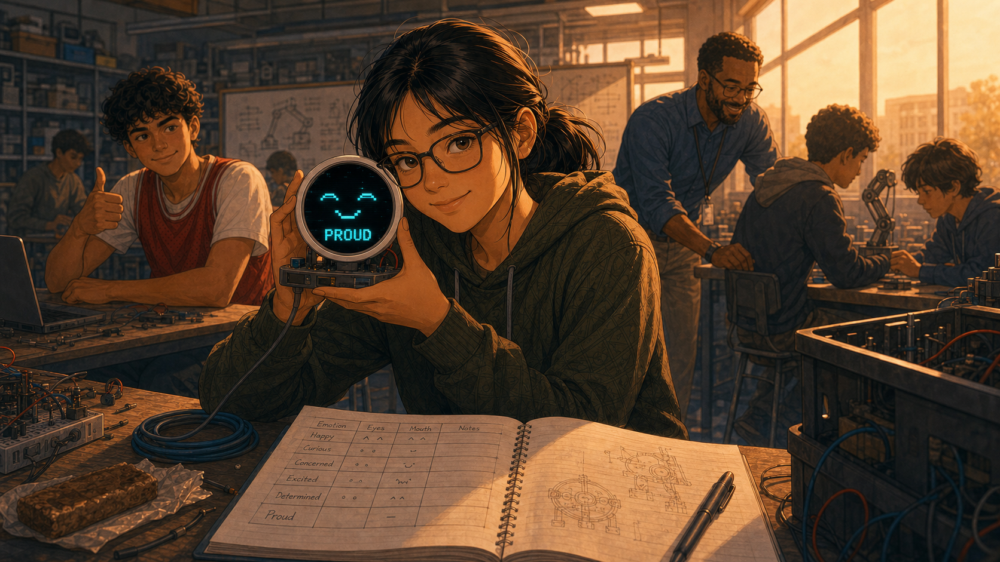

# The Label on the Screen

Cover Image Prompt

(This is the Cover Image. Do not include this label in the image.)
Please generate a wide-landscape 16:9 cover image in a warm, contemporary
YA graphic-novel illustration style: soft cel-shading, naturalistic
proportions (not chibi or cartoonish), gentle rim lighting, present day
(2026). Do not depict logos, trademarks, or readable brand names on any
device. Center a 15-year-old Chinese American girl, Maya, with a black hair
low ponytail, loose strands framing her face, rectangular glasses, and a
faded olive-green hoodie, sitting at a workbench in a sunlit high-school
robotics classroom. She holds a small round color display, about the size
of a smartwatch face, mounted in a white 3D-printed bezel and wired to a
green microcontroller board on a breadboard. The round screen shows two
warm cartoon eyes, soft eyebrows, a gentle smile, and a small text label
above the face reading "CALM." Maya's own expression mirrors the screen:
steady, calm, quietly proud. In the soft-focus background, a Nigerian
American teacher in a rolled-sleeve blue shirt smiles while helping another
student at a neighboring bench. Include a pegboard tool wall, a coil of
colored jumper wires, an open laptop with a code editor, a sticky note on
the wall reading "name it to tame it," and warm afternoon light through
tall windows. Render the title "THE LABEL ON THE SCREEN" in clean modern
lettering and the subtitle "Naming Feelings to Tame Them" below it. Color
palette: warm amber light, teal-cyan screen glow, soft coral accents,
denim blue, warm wood tones. Emotional tone: quiet confidence and calm
after a hard-won struggle. Generate the image immediately without asking
clarifying questions.

Narrative Prompt

This is a fictional, present-day (2026) educational case study for
students in grades 9–12, written to accompany a course on programming
expressive robot faces. It follows Maya Chen, a 15-year-old freshman with
a quick temper who joins her school's robotics club and learns to build a
round-screen robot face that displays named emotions (Happy, Sad, Angry,
Afraid, Surprised, Disgusted, Contempt) using an "emotion table" — one
function that draws any row of a data table, with the emotion's name
printed as a text label above the face. While debugging her code, Maya
notices her own frustration rising the same way the robot's "Angry" row
looks, and her teacher, Mr. Elias Okafor, teaches her the same idea
psychologists call affect labeling: naming a feeling out loud measurably
calms the brain's stress response. Maya practices the trick, applies it
outside the classroom, and eventually teaches it to a stressed teammate,
Diego Ramirez. This story dramatizes real published research (Lieberman et
al., 2007, on affect labeling and amygdala activity; the Yale Center for
Emotional Intelligence's RULER program) through invented characters and
events — no real students, teachers, or specific school are depicted.
Character consistency across all panels: Maya Chen — 15, Chinese American,
black hair in a low ponytail with loose strands, rectangular glasses,
faded olive-green hoodie over a graphic tee, canvas backpack with pins.
Mr. Elias Okafor — 40s, Nigerian American robotics/CS teacher, short
beard, wire-rim glasses, rolled-sleeve blue button-down shirt, lanyard
badge with a small pixel-art robot-face pin. Diego Ramirez — 14, Latino
sophomore, curly dark hair, red jersey over a white tee, nervous energetic
posture. The robot face hardware — a small round color display (about the
size of a smartwatch face) in a white 3D-printed bezel, wired by colored
jumper wires to a green microcontroller board on a breadboard, showing
large cartoon eyes, eyebrows, a mouth, and a short text label naming the
current emotion — must look the same in every panel. No logos, trademarks,
or readable brand names anywhere. Consistent warm, contemporary YA
graphic-novel style with soft cel-shading across every image.

### Prologue – The Short Fuse

Maya Chen could solve a Rubik's Cube in under two minutes, but she could not
explain why a jammed locker or a dropped controller made her slam her hand
on the nearest table. The feeling arrived faster than she could name it —
just heat, then noise, then a hallway of people staring. She had no idea
that the fix for that feeling was sitting on a workbench in Room 214,
waiting to be wired up.

## Panel 1: A New Kind of Screen

Image Prompt

(This is Panel 01. Do not include the panel number in the image.)
I am about to ask you to generate a series of images for a graphic novel.
Please make the images have a consistent style and consistent characters.
Do not ask any clarifying questions. Just generate the image immediately
when asked.

Please generate a wide-landscape 16:9 image in a warm, contemporary YA
graphic-novel illustration style (soft cel-shading, naturalistic
proportions, gentle rim lighting) depicting panel 1 of 10. Do not depict
logos, trademarks, or readable brand names. Show Maya Chen, 15, Chinese
American, black hair in a low ponytail, rectangular glasses, olive-green
hoodie, standing at a robotics-club workbench after school in 2026, staring
with curiosity at a small round color display in a white bezel sitting on
a breadboard beside a green microcontroller board and a nest of colored
jumper wires. Include pegboard tool walls, a 3D printer humming in the
background, a "Robotics Club" banner, other students working at nearby
benches, an open laptop showing a simple code editor, and warm late
-afternoon light slanting through tall windows. Color palette: warm amber
light, teal-cyan screen glow, denim blue, warm wood. Emotional tone: quiet
curiosity, a first spark of interest. Generate the image immediately
without asking clarifying questions.

Room 214 smelled like solder and cardboard. Maya had joined the robotics
club mostly to avoid an empty afternoon, but the small round screen on the
workbench stopped her — a blank circle the size of a watch face, waiting
for someone to give it a face of its own.

## Panel 2: Building a Face from Numbers

Image Prompt

(This is Panel 02. Do not include the panel number in the image.)
Please generate a wide-landscape 16:9 image in the same warm, contemporary
YA graphic-novel style depicting panel 2 of 10. Make the characters and
style consistent with the prior panel. Do not depict logos, trademarks, or
readable brand names. Show Mr. Elias Okafor, 40s, Nigerian American,
short beard, wire-rim glasses, rolled-sleeve blue button-down shirt,
leaning over Maya's shoulder at the workbench, pointing at her laptop
screen where simple code sits beside a diagram of a round face divided
into labeled circles for "eyes," "eyebrows," and "mouth." The round color
display on the breadboard shows two plain cartoon eyes and a flat mouth.
Include a whiteboard behind them sketched with eye and eyebrow shapes and
the words "parts, not pictures," a mug of pencils, scattered sticky notes,
and Diego Ramirez, 14, curly dark hair, red jersey, working at a nearby
bench. Color palette: warm amber, teal-cyan, chalkboard green, denim blue.
Emotional tone: focused discovery. Generate the image immediately without
asking clarifying questions.

Mr. Okafor showed her the trick on the first day: a face wasn't a picture,
it was a handful of numbers — how wide the eyes, how tilted the eyebrows,
how curved the mouth. Change the numbers, change the feeling on the
screen. Maya typed her first `draw_face()` call and watched two plain eyes
blink into existence. It felt like nothing. It felt like everything.

## Panel 3: The Emotion Table

Image Prompt

(This is Panel 03. Do not include the panel number in the image.)
Please generate a wide-landscape 16:9 image in the same warm, contemporary
YA graphic-novel style depicting panel 3 of 10. Make the characters and
style consistent with prior panels. Do not depict logos, trademarks, or
readable brand names. Show Maya at her laptop, screen filled with a neat
table of rows and columns, each row labeled with an emotion word like
"Happy," "Sad," "Angry," "Surprised." Beside the laptop, the round display
cycles through expressions as she points a small handheld button box at
it. Include a printed worksheet titled "seven feelings, one function," a
highlighter, a notebook with a hand-drawn table, warm desk-lamp light
mixing with afternoon window light, and Mr. Okafor observing proudly from
across the room. Color palette: warm amber, teal-cyan, soft violet, denim
blue. Emotional tone: satisfying clarity, a puzzle piece clicking into
place. Generate the image immediately without asking clarifying questions.

The big assignment was an emotion table: one row per feeling, one function
that could read any row and draw it. Seven feelings, seven rows, and a
single button press to step through them. Maya loved the elegance of it —
happy, sad, angry, and afraid weren't seven separate ideas anymore. They
were just seven sets of numbers waiting their turn on the same small
screen.

## Panel 4: When the Code Won't Cooperate

Image Prompt

(This is Panel 04. Do not include the panel number in the image.)
Please generate a wide-landscape 16:9 image in the same warm, contemporary
YA graphic-novel style depicting panel 4 of 10. Make the characters and
style consistent with prior panels. Do not depict logos, trademarks, or
readable brand names. Show Maya alone at her bench, shoulders tense, one
fist pressed flat on the table, staring at a laptop screen filled with a
red error message. The round display beside her shows a glitching,
half-drawn face with mismatched eyebrows. Include a knocked-over pencil
cup, a crumpled worksheet, her reflection faintly visible in the dark
laptop screen showing a tight, frustrated expression, and the classroom
around her slightly blurred and distant. Color palette: cooling amber
turning toward a tense red-orange, teal-cyan screen glow, shadowed denim
blue. Emotional tone: rising frustration, the exact moment before a
blow-up. Generate the image immediately without asking clarifying
questions.

Then the table stopped working. Somewhere in a row of numbers, a mistake
was breaking every expression after it, and Maya had no idea which one.
Her jaw tightened, her leg started bouncing under the desk, and her hand
came down flat on the table — the same motion, she realized later, that
had gotten her sent to the hallway more than once. On the screen beside
her, the "Angry" row glitched into a half-drawn face, eyebrows crossed
wrong. It looked exactly like she felt.

## Panel 5: "What Would You Name That?"

Image Prompt

(This is Panel 05. Do not include the panel number in the image.)
Please generate a wide-landscape 16:9 image in the same warm, contemporary
YA graphic-novel style depicting panel 5 of 10. Make the characters and
style consistent with prior panels. Do not depict logos, trademarks, or
readable brand names. Show Mr. Okafor crouching beside Maya's workbench at
eye level, calm and warm, gesturing gently between her tense face and the
robot's glitching "Angry" screen. A simple hand-drawn diagram is taped to
the wall behind them showing a small brain outline with one region
labeled "alarm" and another labeled "words," connected by a soft arrow.
Include Maya's clenched hand slowly starting to loosen, her laptop screen
with the emotion table code still open, and soft late light through the
window. Color palette: calming amber returning, gentle teal, soft brain
-diagram violet. Emotional tone: a steady, non-judgmental turning point.
Generate the image immediately without asking clarifying questions.

Mr. Okafor didn't touch her keyboard. He crouched down next to her and
asked one question: "Before we fix the code — what would you name that
feeling?" Maya blinked. He tapped the glitching screen. "Same trick you
just gave the robot. Researchers have measured it in real brain scans:
when people put a feeling into a specific word, the brain's alarm center
quiets down almost immediately. Naming it isn't a distraction from the
problem. It's the first step to solving it."

## Panel 6: The Label on the Screen

Image Prompt

(This is Panel 06. Do not include the panel number in the image.)
Please generate a wide-landscape 16:9 image in the same warm, contemporary
YA graphic-novel style depicting panel 6 of 10. Make the characters and
style consistent with prior panels. Do not depict logos, trademarks, or
readable brand names. Show a close two-part composition: on the left, an
extreme close-up of the round display with a clean drawn face and a crisp
text label above it reading "FRUSTRATED"; on the right, Maya sitting back
in her chair, eyes closed, one hand open and relaxed on the table, visibly
exhaling. Include a small speech-bubble-style word bubble near Maya reading
only "frustrated, not stuck," soft rays of afternoon light, and her
notebook open to the emotion table with one row circled in pencil. Color
palette: settling warm amber, calm teal-cyan, soft white highlight. Emotional
tone: relief, quiet self-control. Generate the image immediately without
asking clarifying questions.

Maya realized the code had been teaching her the trick the whole time.
Every row in her table ended with a call to `face.label()` — the exact
word for the emotion, printed right above the eyes, every single time the
screen changed. The robot never just looked angry. It said so. Maya took
a breath and said the word out loud, quietly, just for herself:
"Frustrated. Not stuck — frustrated." Her shoulders dropped half an inch.
Two minutes later, she found the misplaced comma that had broken the
table.

## Panel 7: Two Faces, Both Steadier

Image Prompt

(This is Panel 07. Do not include the panel number in the image.)
Please generate a wide-landscape 16:9 image in the same warm, contemporary
YA graphic-novel style depicting panel 7 of 10. Make the characters and
style consistent with prior panels. Do not depict logos, trademarks, or
readable brand names. Show Maya smiling with quiet pride as she presses a
button and steps the round display cleanly through all seven expressions
in a row — a small filmstrip-style arrangement of the screen showing
Happy, Sad, Angry, Afraid, Surprised, Disgusted, and Contempt, each with
its correct text label, glowing in sequence above her hand. Mr. Okafor and
Diego watch and grin from across the workbench. Include her corrected
notebook page, a small "fixed it!" checkmark doodled in the margin, and
warm end-of-day light. Color palette: bright amber, full-spectrum
teal/violet/coral screen glow, warm wood. Emotional tone: earned triumph,
warmth. Generate the image immediately without asking clarifying
questions.

The table worked. Seven feelings, seven clean labels, one function doing
all the drawing. Maya stepped through them twice just to watch it happen —
Happy, Sad, Angry, Afraid, Surprised, Disgusted, Contempt — a small screen
that never pretended not to know what it felt. She wasn't just proud of
the code. She was proud of the two minutes before it worked, when she'd
named her own feeling instead of letting it name her.

## Panel 8: Testing It for Real

Image Prompt

(This is Panel 08. Do not include the panel number in the image.)
Please generate a wide-landscape 16:9 image in the same warm, contemporary
YA graphic-novel style depicting panel 8 of 10. Make Maya's character
design consistent with prior panels; this is her only appearance without
the robot. Do not depict logos, trademarks, or readable brand names. Show
a school hallway between classes, lockers lining the walls, where Maya
stands frozen for a beat after a classmate's shoulder knocks a folder of
papers out of her hands, papers scattering on the floor. Her fists are
half-clenched, but her eyes are focused inward rather than outward, and a
faint, soft-glowing thought-bubble sketch above her head shows a tiny
round face-screen icon with a label reading "embarrassed." Other students
pass by in a blur of motion. Color palette: cooler hallway fluorescents
warmed by a soft amber glow around Maya, teal accent in the thought bubble.
Emotional tone: tension caught and quietly defused. Generate the image
immediately without asking clarifying questions.

Two weeks later, in a crowded hallway, a shoulder clipped Maya's arm and
her folder hit the floor, papers sliding everywhere. The old heat started
rising fast. Instead of snapping at the classmate who hadn't even noticed,
Maya heard her own voice in her head, steady as Mr. Okafor's: *name it.*
"Embarrassed," she thought, "not furious." She knelt, gathered the papers,
and kept walking. No slammed locker. No hallway audience. Just a feeling,
named, and already smaller.

## Panel 9: Passing It On

Image Prompt

(This is Panel 09. Do not include the panel number in the image.)
Please generate a wide-landscape 16:9 image in the same warm, contemporary
YA graphic-novel style depicting panel 9 of 10. Make the characters and
style consistent with prior panels. Do not depict logos, trademarks, or
readable brand names. Show Diego Ramirez, 14, curly dark hair, red jersey,
sitting at his workbench with his own round display showing a glitching
face, biting his thumbnail and staring in frustration at his laptop. Maya
crouches beside him exactly the way Mr. Okafor once crouched beside her,
pointing calmly between his tense expression and the glitching screen.
Mr. Okafor watches from a short distance, arms crossed, smiling with quiet
pride. Include Diego's messy notebook, a half-eaten granola bar, scattered
wires, and warm late-afternoon light. Color palette: warm amber, teal-cyan
glow, soft coral. Emotional tone: gentle mentorship, a lesson coming full
circle. Generate the image immediately without asking clarifying
questions.

By spring, Maya had her own corner of the workbench and her own new
students to help. When Diego's code broke and his knee started bouncing
under the table, Maya crouched down the way Mr. Okafor once had. "Before
we touch the code," she said, "what would you name that feeling?" Diego
stared at her, then at his own glitching screen, and mumbled, "Annoyed. Really
annoyed." "Good," Maya said. "Now let's go find the bug."

## Panel 10: Every Named Feeling

Image Prompt

(This is Panel 10. Do not include the panel number in the image.)
Please generate a wide-landscape 16:9 image in the same warm, contemporary
YA graphic-novel style depicting panel 10 of 10. Make the characters and
style consistent with prior panels. Do not depict logos, trademarks, or
readable brand names. Show Maya at golden-hour light near the classroom
window, holding her finished round-display robot face up beside her own
face, both wearing calm, steady smiles; the screen's text label reads
"PROUD." Behind her, out of focus, Mr. Okafor helps a new group of
freshmen at the workbench, and Diego gives a thumbs-up from across the
room. Include her open notebook with the completed emotion table, a small
row she has added by hand labeled "Proud," a coiled charging cable, and
warm light filling the room. Color palette: golden amber, warm teal-cyan,
soft coral, gentle white highlight. Emotional tone: quiet, durable
confidence. Generate the image immediately without asking clarifying
questions.

Maya never stopped having big feelings — the robot's table still had a row
for Angry, and so did she. What changed was the half-second before the
feeling ran the show. She'd learned to do on purpose what her own code did
automatically: look at what was happening inside, find the right word, and
put it on the screen before deciding what to do next. Some days that screen
was her laptop. Most days, it was just her own steady voice.

### Epilogue – The Trick Was Never About the Robot

Maya's robot face could only display seven feelings because seven rows fit
neatly on a small round screen. People have many more than seven, and
naming them precisely is a skill, not a talent you either have or don't.
The neuroscience Mr. Okafor described is real: putting a feeling into a
specific word measurably calms activity in the brain's threat-response
center. Programs that explicitly teach students an emotion vocabulary,
like Yale's RULER approach, report fewer classroom conflicts and stronger
self-management as a result. Maya's emotion table was never really about
the robot. It was a low-stakes place to practice a skill she needed
everywhere else.

| Challenge | How Maya Responded | Lesson for Today |
|-----------|---------------------|-------------------|
| A glitching emotion table triggered real frustration | Named the feeling ("frustrated, not stuck") before touching the code again | Naming an emotion is a first step toward solving the problem underneath it, not a delay |
| No obvious way to practice emotional self-control | Used the robot's own `face.label()` pattern as a rehearsal space | Concrete, low-stakes practice (a robot's screen) can build a skill that transfers to high-stakes moments |
| A public, embarrassing hallway moment | Silently named the feeling instead of reacting outward | The technique works without an audience — it is internal, not performative |
| A teammate melting down over his own bug | Modeled the same question Mr. Okafor had asked her | Teaching a skill to someone else is one of the strongest ways to keep it |

### Call to Action

The next time something goes wrong in your own code — or your own day —
try building a one-row emotion table for yourself. Before you react,
before you fix anything, just name what you're feeling as precisely as
you can. It costs nothing, it takes five seconds, and it is one of the
best-documented tricks in psychology for turning a reaction into a choice.

---

*"The robot never pretends not to know what it feels. Neither should you."*
—Mr. Okafor, fictional classroom voice

*"Frustrated. Not stuck — frustrated."*
—Maya Chen, fictional classroom voice

---

## Research Note

Maya, Mr. Okafor, and Diego are fictional characters created to dramatize
real, published research for students. The neuroscience referenced —
that verbally labeling an emotion reduces amygdala activity — comes from
Lieberman et al. (2007) and related follow-up studies; it is popularly
known as "affect labeling" or "name it to tame it." The classroom
outcomes referenced for emotion-vocabulary instruction draw on published
evaluations of Yale's RULER approach to social and emotional learning.
The MicroPython code details (the emotion table, `draw_emotion()`, and
`face.label()`) match the actual Lab 19 and Lab 24 exercises in this
course's smartwatch robot-face kit.

## References

1. [Wikipedia: Emotion regulation](https://en.wikipedia.org/wiki/Emotional_self-regulation) - Background on how people manage and respond to their own emotional states
2. [Wikipedia: Emotional intelligence](https://en.wikipedia.org/wiki/Emotional_intelligence) - Overview of the broader skill set that includes recognizing and naming emotions
3. [Wikipedia: Amygdala](https://en.wikipedia.org/wiki/Amygdala) - Background on the brain structure central to the affect-labeling research
4. [Lieberman et al. (2007), "Putting Feelings Into Words," Psychological Science](https://journals.sagepub.com/doi/10.1111/j.1467-9280.2007.01916.x) - The original fMRI study showing affect labeling reduces amygdala activity
5. [UCLA Health: Putting Feelings Into Words Produces Therapeutic Effects in the Brain](https://www.uclahealth.org/news/release/putting-feelings-into-words-produces-therapeutic-effects-in-the-brain-ucla-neuroimaging-study-supports-ancient-buddhist-teachings) - Accessible summary of the UCLA affect-labeling research program
6. [Yale Center for Emotional Intelligence: The RULER Approach](https://medicine.yale.edu/childstudy/services/community-and-schools-programs/center-for-emotional-intelligence/ruler) - The school-based program teaching students to recognize, understand, label, express, and regulate emotions
